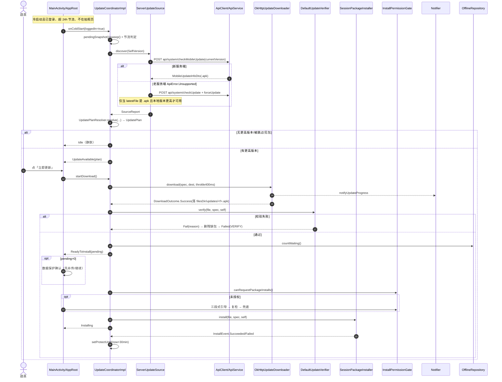
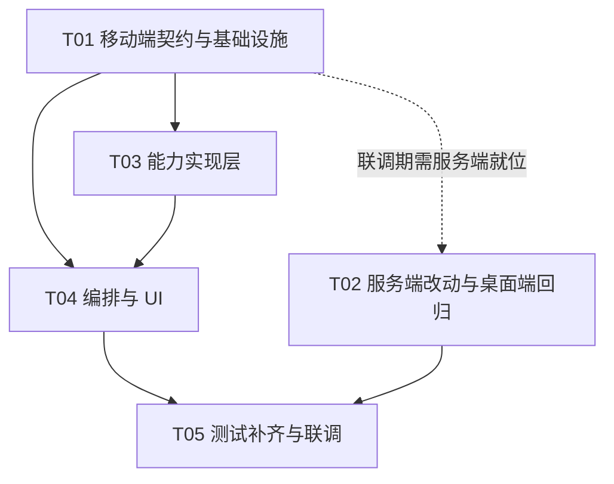

# 移动端「内置在线更新」增量架构设计与任务拆解

> **定位**：本文件是面向排期的**工程交付清单**（基于定稿 `docs/prd.md`）。详细权衡、接口完整签名、服务端实现伪码、测试断言点等「长表单」集中在 `docs/mobile-updater-design.md`，类图/时序图分别见 `docs/class-diagram.mermaid`、`docs/sequence-diagram.mermaid`（三者词汇一致，配套使用）。
> **仓库**：`xingqiyi-laundry-photo-android`（本地 `C:\build\xqy-android-repo`）；配套最小改动 `xingqiyi-laundry-photo` 桌面端（本地 `E:\软件开发\星期衣精致洗衣衣物照片系统`）。
> **发版目标**：`versionName 1.1.0` / `versionCode` 自 10500 起 +1。
> **技术栈**：Kotlin + Jetpack Compose + Material3，minSdk 26 / targetSdk 34 / compileSdk 34。
> **性质**：增量设计，新增「更新模块」，不重构既有代码。

---

## 0. 与 PRD 的可追溯性（编号映射）

| 本文位置 | 对应 PRD（定稿 `prd.md`） |
|---|---|
| §1 模块边界 / 六角色 | §3.4 接口边界、D1/D4/D10 |
| §2 文件清单 | §3.3 工程约定 1/2/3、C7/C8 |
| §3 DTO / 状态机 | U-02、C4、附录 A.2/A.3、§3.5 |
| §3 下载/校验/安装接口 | U-06/U-07/U-08/U-09/U-10/U-11、C3/C5 |
| §4 时序图 | §3.2 SC-1…SC-12、§3.5.2/§3.5.3 |
| §5 任务列表 | §六 里程碑 M1–M4、U-01…U-18 |
| §6 依赖 | C5、D10 |
| §7 共享知识 | §3.3 工程约定、NFR-M7、NFR-S 系列 |
| §8 待拍板 | 附录 D、附录 B Q1–Q9、附录 C 假设 |

---

## 1. 实现方案与框架选型

### 1.1 总体思路（呼应 PRD §3.4）

在现有工程上**新增 `data.update` 领域包 + `ui.update` 界面包 + 最小改造若干现有文件**，绝不触碰拍照/查询/日志链路。严格遵循「六角色接口化、单向依赖」：

- **UI 层（`ui.update`）只认 `UpdateCoordinator` 暴露的 `StateFlow<UpdateState>`**，绝不直接持有 `OkHttp` / `PackageInstaller` / `PackageManager`（NFR-M2）。
- **编排层（`UpdateCoordinatorImpl`）持有六个角色接口**，输出唯一真相源状态机（PRD §3.5）。
- **六个角色（`UpdateSource / UpdateDownloader / UpdateVerifier / UpdateInstaller / UpdatePolicyStore` + 编排器）全部接口化、可注入替换**（NFR-M1 / U-18）。
- **纯逻辑（版本比较、计划合并、文件名安全、失败映射、诊断）抽成无 Android 依赖的 `object`/纯函数**，便于纯英文路径下跑单测（NFR-M3 / C10 / U-18）。

依赖方向严格单向（红线：**UI 不得直接持有 OkHttp/`PackageInstaller`/`StatFs` 或任何系统服务，必须夹在接口后由构造注入**）：

```
ui/update → UpdateViewModel → UpdateCoordinator(interface)
                                      │
            ┌─────────────────────────┼───────────────────┬──────────────┐
            ▼                         ▼                   ▼              ▼
     UpdateSource          UpdateDownloader        UpdateVerifier  UpdateInstaller
            │                         │                   │              │
            └──▶ ApiService ◀─────────┘           ApkInspector   PackageInstaller
                                  UpdateFileStore / UpdatePolicyStore / UpdateLogger（基础设施）
```

### 1.2 四个核心能力如何落地

**① 版本发现（U-01/U-02/U-03/D1）**
- 服务端新增 `POST /api/system/checkMobileUpdate`（只扫 `.apk`，返回 `fileName/version/size/sha256/notes/notesSource/hasPackage/hasUpdate`，`hasUpdate` 按请求体 `currentVersion` 比较）。
- `ServerUpdateSource`：先打新接口；收到 `ApiError.Unsupported`（老服务端回「接口不存在」）时静默降级到老 `checkUpdate`+`forceUpdate`，且老接口结果**必须** `latestFile` 以 `.apk` 结尾且本地版本比较确实更高才可用（否则当无包，静默回 `Idle`）。这是跨端不串台（R-01）与老服务端零打扰（R-02）的根本保证。
- 新 DTO `MobileUpdateInfoDto` 放 `data.model`（被现有 proguard keep 覆盖，C8），全字段可空 + 计算属性兜底（C4 血泪教训）。

**② 下载（U-06/U-07/U-08/U-17/D10）**
- **独立 `OkHttpClient` 实例**，由 `ApiClient.downloadClient()` 暴露（**不是** Retrofit 那个）：Retrofit 实例挂了 `ResponseSnippetCaptureInterceptor`（会把 21MB 响应读进内存脱敏 → OOM，R4），且 readTimeout 仅 60s 盖不住弱网大文件。独立实例配长超时 + `AuthInterceptor`（连接码走 `x-api-token` 头）。
- **连接码走请求头、不进 URL**：实测 `server.js:220` `handleUpdateFile` 同时接受 `x-api-token` 头与 `token` 查询参数，头方式可用（NFR-S4，无需额外服务端改动）。`updateFileUrl()` 仅拼 `f=<fileName>`，不含 token（R5）。
- 流式写盘 8–64KB 分块 → `filesDir/updates/<fileName>.part` → 成功 `rename` 原子替换（NFR-R3/NFR-P4）。**不建在 WorkManager**（D10）：由 `UpdateCoordinatorImpl` 持有的应用级 `CoroutineScope` 承担，UI 经 `StateFlow` 观察；旋转/跳转/退出不中断；进程被杀→冷启动落 `Failed(INTERRUPTED, retryable)` 并清 `.part`。
- 进度回调节流 **400ms 或百分比变化 ≥1%**（U-07），UI 与 `xqy_update` 通知同步，百分比单调不减。
- 弱网分级（D11/NFR-N2–N4）：`OkHttpUpdateDownloader` **自己写看门狗**（OkHttp `readTimeout` 语义不可靠）——每 2s 轮询 `lastByteAt`：连续 20s 无字节→`STALLED`；连续 15s 均速 <20KB/s→`TOO_SLOW`；触发即 `call.cancel()`。自动 3 次指数退避 2s→6s→15s（±20% Jitter 防重试风暴，R6）；401/403/404/磁盘满**不重试**；5xx 额外 1 次。
- 磁盘预检（U-17）：`StatFs` 要求可用空间 ≥ `size*1.5 + 20MB`，不足则不下第一字节（U-COPY-22 + 清理按钮）。

**③ 校验（U-09/D3/NFR-S1/S2）**
- 四级，顺序不可变：**① size**（服务端给且≠0 才校）→ **② sha256**（服务端给才校）→ **③ 包名 == `SelfVersion.packageName`**（debug 构建额外允许 `RELEASE_APPLICATION_ID`）→ **④ versionCode 严格大于已安装**。
- ① ② 可跳过；③④ 永不跳过（防装山寨包/更低版本）。`sha256` 空串 / `size=0` 即跳过对应项，**绝不阻断更新**（D3）。
- `DefaultUpdateVerifier` 组合 `ApkInspector`(`PackageManager.getPackageArchiveInfo`) + 纯规则类 `VerifyRules`（JVM 纯单测可全覆盖，U-18 主要来源）。

**④ 安装（U-10/U-11/D8/NFR-C4/C7）**
- 主路径 `SessionPackageInstaller`：`PackageInstaller.Session` + 动态注册回执 `BroadcastReceiver`(`RECEIVER_NOT_EXPORTED`)；Session 打开/写入抛异常时降级 `IntentInstaller`（`ACTION_VIEW` + FileProvider `content://` + `FLAG_GRANT_READ_URI_PERMISSION`）。
- 回执分诊（U-10）：`SUCCESS/BLOCKED/CONFLICT/INCOMPATIBLE/INVALID/STORAGE` + 回执丢失→冷启动比对 `versionCode`（NFR-R1）。`UpdateFailureMapper` 是「错误→文案+是否可重试+重试上限」的唯一来源（10.5）。
- `REQUEST_INSTALL_PACKAGES` **三段式引导**（`InstallPermissionGate`，复用 `CameraPermissionGate` 思路）：说明→跳 `ACTION_MANAGE_UNKNOWN_APP_SOURCES`(URI `package:<自身包名>`)→返回复检→多次拒绝给「打开设置 + 我已开启，重新检查」兜底（NFR-C7）。

### 1.3 关键选型决策（与 PRD 一致，源自 `mobile-updater-design.md §1.2`）

| 关注点 | 选型 | 一句话理由 |
|---|---|---|
| 调度载体 | 应用级 `CoroutineScope`（SupervisorJob+IO），挂 `AppContainer` | 否 WorkManager：更新是用户盯着的前台短任务，需秒级取消/重试，WorkManager 最小间隔与持久化会话都不适合 |
| HTTP 出口 | `ApiClient.downloadClient()` 返回**独立** OkHttp 实例 | 否复用 Retrofit 实例：避开内存炸弹拦截器与 60s 超时 |
| 鉴权 | `x-api-token` 请求头，不进 URL | 服务端 `handleUpdateFile` 已支持头方式；避免连接码进日志/抓包 |
| APK 目录 | **`filesDir/updates/`**（非 cacheDir） | cacheDir 易被国内清理类 App 抹掉；副作用用 `backup_rules.xml`+`data_extraction_rules.xml` 排除（S1/R2） |
| 安装主路径 | `PackageInstaller.Session` | 能拿结构化 `EXTRA_STATUS` 做精细化分诊与确定性回执 |
| 校验 | `ApkInspector` 接口 + 纯 `VerifyRules` | 规则不碰 Android → JVM 纯单测全覆盖 |
| 状态 | `UpdateCoordinator` 持 `StateFlow<UpdateState>` | UI 只认状态不认流程，旋屏/跳转不中断下载 |
| DTO 位置 | 只放 `data.model` | 铁律：避免引入第二个需 keep 的包（C8/R1） |
| UI 形态 | `AppRoot` 之上的全屏浮层 `UpdateOverlay` | 任意页面/通知点击都能展示；不打断拍照/连拍页（UI 主动告知 Coordinator 当前路由是否允许展示，实现延后） |

---

## 2. 文件清单与相对路径

> 包基底：`com.xingqiyi.laundryphoto.update`（实现/接口）与 `com.xingqiyi.laundryphoto.ui.update`（UI）。以下相对路径以 `app/src/main/` 或仓库根为基准。

### 2.1 移动端 · 新增文件（`java/com/xingqiyi/laundryphoto/…`）

| # | 相对路径 | 职责 |
|---|---|---|
| 1 | `data/update/UpdateContract.kt` | 六大接口 + 全部值对象（`SelfVersion/RemoteApk/UpdatePlan/DownloadSpec/DownloadProgress/VerifyResult/InstallHandle/DownloadOutcome/UpdateState/SourceReport/ForceTrack/PendingUpdateSnapshot/ForcePostpone/FailureCopy`） |
| 2 | `data/update/VersionComparator.kt` | 纯版本比较器，与 `store.js compareVersions` 逐条对齐（Q9） |
| 3 | `data/update/UpdatePlanResolver.kt` | 纯逻辑：可选/强制轨合并、跳过命中、推迟计数、宽限判定（D4/D5） |
| 4 | `data/update/UpdateFailureMapper.kt` | 纯逻辑：错误分级 → 文案资源 + 是否可重试 + 重试上限 |
| 5 | `data/update/ServerUpdateSource.kt` | `UpdateSource` 默认实现：新接口→老接口降级 + 强制轨 `.apk` 防御 |
| 6 | `data/update/OkHttpUpdateDownloader.kt` | `UpdateDownloader` 默认实现：写 `.part`/rename、进度节流、断流/低速看门狗、指数退避、取消 |
| 7 | `data/update/UpdateFileStore.kt` | 接口 + `DefaultUpdateFileStore`：目录、`.part`、原子 rename、`StatFs`、清理与 30min 保护窗 |
| 8 | `data/update/DefaultUpdateVerifier.kt` | `UpdateVerifier` 默认实现：size→sha256→包名→versionCode |
| 9 | `data/update/ApkInspector.kt` | `ApkInspector` 接口 + `PackageManagerApkInspector` + 纯规则 `VerifyRules` + `SpaceRule` |
| 10 | `data/update/SessionPackageInstaller.kt` | `UpdateInstaller` 默认实现：Session 主路径 + `IntentInstaller` 降级 + 动态回执 Receiver |
| 11 | `data/update/DataStoreUpdatePolicyStore.kt` | `UpdatePolicyStore` 默认实现（独立 DataStore `xqy_update`，17 个扁平 key，无 JSON） |
| 12 | `data/update/UpdateLogger.kt` | Logcat `XqyUpdate` + `update.log` 滚动 200 条 + 脱敏（NFR-S6） |
| 13 | `data/update/UpdateDiagnostics.kt` | 纯逻辑：「复制错误信息」文本组装（错误类型 + HTTP 状态 + 日志末尾 20 行） |
| 14 | `data/update/UpdateCoordinatorImpl.kt` | 状态机、角色装配、节流、合并、冷启动恢复 |
| 15 | `ui/update/UpdateOverlay.kt` | 全屏浮层宿主：按 `UpdateState` 分派 |
| 16 | `ui/update/UpdateDialogs.kt` | 可选更新对话框 / 强制更新对话框 / 全屏阻断页 |
| 17 | `ui/update/UpdateDownloadPanel.kt` | 下载中 / 退避等待 / 校验中 / 安装中 / 失败界面 |
| 18 | `ui/update/InstallPermissionGate.kt` | 「允许安装未知应用」三段式引导 |
| 19 | `ui/update/UpdateDataGuard.kt` | `pending>0` 数据保护确认 + 补传进度 + 「备份到相册」按钮位（P1/U-19） |
| 20 | `ui/update/UpdateSettingsCard.kt` | 设置页「软件更新」卡片（当前版本/上次检查/红点/清理缓存） |
| 21 | `ui/update/UpdateViewModel.kt` | 桥接 Coordinator 的 `StateFlow` → Compose 状态 |

### 2.2 移动端 · 修改文件

| 文件 | 改动点 |
|---|---|
| `build.gradle.kts` | 新增 `buildConfigField("String","RELEASE_APPLICATION_ID")`（debug 包名校验用，S4）；可选加 `mockwebserver` 测试依赖 |
| `AndroidManifest.xml` | 新增 `REQUEST_INSTALL_PACKAGES`；挂 `fullBackupContent`/`dataExtractionRules` |
| `res/xml/file_paths.xml` | 新增受限 `<files-path name="shared_updates" path="updates/"/>` |
| `res/xml/backup_rules.xml`（**新**） | Android ≤11 备份规则：排除 `updates/` |
| `res/xml/data_extraction_rules.xml`（**新**） | Android 12+ 迁移规则：同上 |
| `res/values/strings.xml` | U-COPY-01…35 + `channel_update_name/desc` + 调试提示 `update_copy_debug`（U-COPY-36） |
| `data/model/Models.kt` | 新增 `MobileUpdateInfoDto`；`UpdateInfoDto` 补 `latestFile`；`ForceUpdateDto` 补 `fileExists/files`（全可空+兜底） |
| `data/remote/ApiService.kt` | 新增 `checkMobileUpdate(body)` |
| `data/remote/ApiClient.kt` | 新增 `downloadClient()` 与 `updateFileUrl()`（**不改 `buildService`**） |
| `di/AppContainer.kt` | 装配六角色、提供 `updateIoScope`、冷启动清理入口、暴露 `val update` |
| `LaundryApp.kt` | `onCreate` 触发一次异步更新缓存清理 |
| `ui/settings/SettingsScreen.kt` | 插入软件更新卡片 + Snackbar 通道 |
| `ui/settings/SettingsViewModel.kt` | 暴露 `lastCheckAtText`/`hasUpdateBadge`/`clearUpdateCache()`/手动检查入口 |
| `ui/MainActivity.kt` | 删除旧 `forceUpdate→notifyForceUpdate` 逻辑（C9）；挂 `UpdateOverlay`；路由→`setOverlayAllowed`；提供退出应用回调 |
| `sync/Notifier.kt` | 新增 `CHANNEL_UPDATE="xqy_update"` 与 `notifyUpdateProgress/notifyUpdateReady/cancelUpdate`；删除已无调用点的 `notifyForceUpdate` |
| `proguard-rules.pro` | **无需改动**——新 DTO 仍在 `data.model`，现有 `-keep class …data.model.** { *; }` 已覆盖（C8/R1） |

### 2.3 桌面端 · 最小改动（仅做附录 A 所列，向后兼容）

| 文件 | 改动点 |
|---|---|
| `main/store.js` | ① 新增 `checkMobileUpdate(params)`（扫 `.apk`、取最高版本、`fs.statSync` 取 size、流式算 sha256 并缓存、读同名 `.md`/`.json` 的 notes、`hasUpdate` 用 `params.currentVersion`）；② `listUpdateFiles()` 正则 `/\.(exe|zip|msi)$/i` → `/\.(exe|zip|msi|apk)$/i`（一行）；③ 导出表追加；④ `CAPABILITIES.features` 加 `mobileUpdate: true`（不改 `apiVersion`） |
| `main/server.js` | routes 表在 `system/checkUpdate` 之后新增一行 `'system/checkMobileUpdate': () => store.checkMobileUpdate(body)` |
| `package.json` / `docs/manual.md` | 版本号 bump（如 1.2.3→1.2.4，prebuild 校验会拦） |
| `scripts/verify-store.js` / `scripts/verify-server.js`（建议） | 新增断言：只扫 apk / 无 apk 时 `ok=true` / 跨端共存必返回 apk / sha256 一致 / notes 三级降级 |
| `main/update-download.js` 等桌面端自更新链路 | **不改**（R3 风险见 §8，建议性 S5 另议） |

### 2.4 新增单元测试（落 `app/src/test/...`，纯英文路径，C10）

至少 8 个，其中 5 个 JVM 纯（无 Android 依赖）：`VersionComparatorTest`、`UpdatePlanResolverTest`、`UpdateFailureMapperTest`、`MobileUpdateInfoDtoCompatTest`、`ApkFileNameSafetyTest`（纯）、`DefaultUpdateVerifierTest`（Fake ApkInspector）、`UpdateCoordinatorRecoveryTest`（全 Fake）、`UpdateFileStoreTest`（Robolectric）、`BackupExclusionTest`（守卫）。

---

## 3. 数据结构与接口（类图 + 关键签名）

> 完整类图见 **`docs/class-diagram.mermaid`**（下文为摘录核心）。所有签名源自 `mobile-updater-design.md §2/§4`，可直接照抄。

### 3.1 类图（摘录，完整版见 `docs/class-diagram.mermaid`）

```mermaid
classDiagram
    class UpdateCoordinator {
        <<interface>>
        +state: StateFlow~UpdateState~
        +progress: StateFlow~DownloadProgress~
        +onColdStart(loggedIn: Boolean)
        +setOverlayAllowed(allowed: Boolean)
        +check(trigger: CheckTrigger)
        +startDownload()
        +cancelDownload()
        +retry()
        +skipVersion()
        +postpone()
        +confirmInstall()
        +clearCacheBytes(): Long
        +copyDiagnostics(): String
    }
    class UpdateCoordinatorImpl
    class UpdateSource {
        <<interface>>
        +discover(self: SelfVersion): SourceReport
    }
    class ServerUpdateSource
    class UpdateDownloader {
        <<interface>>
        +download(spec, dest, onProgress): DownloadOutcome
        +cancel()
    }
    class OkHttpUpdateDownloader
    class UpdateVerifier {
        <<interface>>
        +verify(file, spec, self): VerifyResult
    }
    class DefaultUpdateVerifier
    class ApkInspector {
        <<interface>>
        +inspect(file): ApkInfo
    }
    class PackageManagerApkInspector
    class VerifyRules {
        <<pure>>
        +check(expected, actual): VerifyResult
    }
    class UpdateInstaller {
        <<interface>>
        +canRequestPackageInstalls(): Boolean
        +install(file, spec, self): InstallHandle
    }
    class SessionPackageInstaller
    class IntentInstaller
    class UpdatePolicyStore {
        <<interface>>
        +lastCheckAt(host): Long
        +markChecked(host, ms)
        +skippedVersion(): Flow~String~
        +postpone(): ForcePostpone
        +bumpPostpone(version, ms)
        +pendingSnapshot(): PendingUpdateSnapshot?
        +protectUntilMs(): Long
    }
    class DataStoreUpdatePolicyStore
    class UpdateFileStore {
        <<interface>>
        +updateDir: File
        +finalFileFor(name): File
        +partFileFor(name): File
        +requiredBytesFor(size): Long
        +availableBytes(): Long
        +commitPart(name)
        +sweep(nowMs, protectMs, retainMs): Long
    }
    class DefaultUpdateFileStore
    class UpdatePlanResolver {
        <<pure object>>
        +GRACE_WINDOW_MS
        +MAX_POSTPONE
        +resolve(input: ResolveInput): Resolution
    }
    class VersionComparator {
        <<pure object>>
        +compare(a, b): Int
        +isNewer(candidate, current): Boolean
    }
    class UpdateFailureMapper {
        <<pure object>>
        +fromDownload(f: DownloadFailure): FailureCopy
        +fromInstall(f: InstallFailure): FailureCopy
    }
    class UpdateDiagnostics {
        <<pure>>
        +build(state, self, conn): String
    }
    class UpdateLogger
    class UpdateState {
        <<sealed>>
    }

    UpdateCoordinator <|.. UpdateCoordinatorImpl
    UpdateSource <|.. ServerUpdateSource
    UpdateDownloader <|.. OkHttpUpdateDownloader
    UpdateVerifier <|.. DefaultUpdateVerifier
    ApkInspector <|.. PackageManagerApkInspector
    UpdateInstaller <|.. SessionPackageInstaller
    UpdateInstaller <|.. IntentInstaller
    UpdatePolicyStore <|.. DataStoreUpdatePolicyStore
    UpdateFileStore <|.. DefaultUpdateFileStore
    UpdateCoordinatorImpl --> UpdateSource : uses
    UpdateCoordinatorImpl --> UpdateDownloader : uses
    UpdateCoordinatorImpl --> UpdateVerifier : uses
    UpdateCoordinatorImpl --> UpdateInstaller : uses
    UpdateCoordinatorImpl --> UpdateFileStore : uses
    UpdateCoordinatorImpl --> UpdatePolicyStore : uses
    UpdateCoordinatorImpl --> UpdateLogger : uses
    UpdateCoordinatorImpl --> UpdatePlanResolver : uses
    UpdateCoordinatorImpl --> VersionComparator : uses
    UpdateCoordinatorImpl --> UpdateFailureMapper : uses
    UpdateCoordinatorImpl --> UpdateDiagnostics : uses
    DefaultUpdateVerifier --> ApkInspector : uses
    DefaultUpdateVerifier --> VerifyRules : uses
    ServerUpdateSource --> MobileUpdateInfoDto : 反序列化
    OkHttpUpdateDownloader --> UpdateFileStore : 写 part 与 rename
```



### 3.2 关键签名草案（Kotlin）

```kotlin
// data/model/Models.kt —— 仍在 data.model 包，复用现有 proguard keep 规则
data class MobileUpdateInfoDto(
    val supported: Boolean? = null, val hasPackage: Boolean? = null,
    val fileName: String? = null, val version: String? = null,
    val size: Long? = null, val sha256: String? = null,
    val notes: String? = null, val notesSource: String? = null,
    val hasUpdate: Boolean? = null, val currentVersion: String? = null
) {
    val isSupported: Boolean get() = supported ?: false
    val hasApkPackage: Boolean get() = hasPackage ?: false
    val fileNameSafe: String get() = fileName.orEmpty()
    val versionSafe: String get() = version.orEmpty()
    val sizeSafe: Long get() = (size ?: 0L).coerceAtLeast(0L)
    val sha256Safe: String get() = sha256.orEmpty()   // 空串 → 跳过哈希校验
    val notesSafe: String get() = notes.orEmpty()
    val isApkFile: Boolean get() = fileNameSafe.endsWith(".apk", ignoreCase = true)
}
// ForceUpdateDto 补：val fileExists: Boolean = false, val files: List<String> = emptyList()
// UpdateInfoDto 补：val latestFile: String = ""

// data/update/UpdateContract.kt（摘录）
interface UpdateSource { suspend fun discover(self: SelfVersion): SourceReport }
data class SourceReport(
    val latestApk: RemoteApk?, val forceTrack: ForceTrack?,
    val origin: UpdateOrigin, val serverHost: String
)
data class RemoteApk(
    val fileName: String, val versionName: String, val sizeBytes: Long,
    val sha256: String, val notes: String, val notesSource: String
)
interface UpdateDownloader {
    suspend fun download(spec: DownloadSpec, dest: File,
                         onProgress: suspend (DownloadProgress) -> Unit): DownloadOutcome
    fun cancel()
}
interface UpdateVerifier {
    suspend fun verify(file: File, spec: RemoteApk, self: SelfVersion): VerifyResult
}
interface UpdateInstaller {
    fun canRequestPackageInstalls(): Boolean
    fun install(file: File, spec: RemoteApk, self: SelfVersion): InstallHandle
}
interface UpdatePolicyStore {
    suspend fun lastCheckAt(host: String): Long
    suspend fun markChecked(host: String, atMs: Long)
    fun skippedVersion(): Flow<String>
    suspend fun setSkippedVersion(version: String?)
    suspend fun postpone(): ForcePostpone
    suspend fun bumpPostpone(version: String, nowMs: Long)
    suspend fun pendingSnapshot(): PendingUpdateSnapshot?
    suspend fun protectUntilMs(): Long
    suspend fun setProtectUntil(ms: Long)
}
```

### 3.3 状态机（PRD §3.5）

`UpdateState` 为 `sealed class`，唯一真相源在 `UpdateCoordinatorImpl`。状态：
`Idle / Checking / UpdateAvailable(plan, mandatory, remainingPostpone) / Blocked(plan) / Downloading(progress) / Verifying / ReadyToInstall(pending) / Installing / Failed(stage, reason, retryable) / Skipped(version) / Postponed`。
关键判据：`Checking→UpdateAvailable` 的唯一依据永远是**客户端本地版本比较**（服务端 `hasUpdate` 仅作提示）；任何 `Failed` 不允许自动回 `Idle`（NFR-R2）；`Installing` 后进程被系统替换，冷启动靠 `PendingUpdateSnapshot.preUpdateVersionCode` 比对已安装 `versionCode` 判定成功（NFR-R1）。

---

## 4. 程序调用流程（时序图）

> 完整时序（5 段：冷启动检查 / 手动检查→下载→校验→安装 / 失败重试与取消 / 强制更新阻断 / 安装回执丢失恢复）见 **`docs/sequence-diagram.mermaid`**。下图为合并主链路示意。



---

## 5. 有序任务列表（按实现顺序，标注依赖）

> 依赖按「最小阻塞」排布：T02（服务端）与 T01/T03 可并行；T04 依赖 T01+T03；T05 依赖全部。每项给出目标 / 涉及文件 / 产出 / 验收 / 依赖。

### T01 · 移动端契约与基础设施 `P0`（依赖：无；可与 T02/T03 并行）
- **目标**：冻结六大接口签名、DTO 全可空兜底、纯逻辑（版本比较/计划合并/失败映射）落地、下载用 OkHttp 出口与文件落地/备份排除就位。
- **涉及文件**：`build.gradle.kts`、`AndroidManifest.xml`、`res/xml/file_paths.xml`、`res/xml/backup_rules.xml`、`res/xml/data_extraction_rules.xml`、`res/values/strings.xml`、`data/model/Models.kt`、`data/remote/ApiService.kt`、`data/remote/ApiClient.kt`、`update/VersionComparator.kt`、`update/UpdateContract.kt`、`update/UpdateFailureMapper.kt`、`update/UpdatePlanResolver.kt`。
- **产出**：① `MobileUpdateInfoDto` 可用且全可空+兜底；② `VersionComparator` 与 `store.js` 语义逐条一致；③ 六接口签名冻结；④ 合并/跳窗/退避规则以纯函数落地；⑤ `apiClient.downloadClient()`/`updateFileUrl()` 可用；⑥ Manifest 权限、FileProvider、备份排除就位。
- **验收**：`VersionComparatorTest`/`UpdatePlanResolverTest`/`UpdateFailureMapperTest`/`MobileUpdateInfoDtoCompatTest`/`BackupExclusionTest` 全绿；`./gradlew :app:testDebugUnitTest` 通过；`ProguardKeepRuleTest` 仍绿。

### T02 · 服务端最小改动 + 桌面端回归 `P0`（依赖：无；可与 T01/T03 并行）
- **目标**：新增 `checkMobileUpdate`、正则放开 apk、注册路由，且桌面端零感知。
- **涉及文件**：桌面端 `main/store.js`、`main/server.js`、`package.json`、`docs/manual.md`、`scripts/verify-store.js`、`scripts/verify-server.js`、`docs/release/v1.2.4-notes.md`。
- **产出**：`checkMobileUpdate` 完整实现 + 导出 + routes + `features.mobileUpdate` + 正则放开 + verify 脚本断言。
- **验收**：① `npm run verify` 全绿；② exe+apk 共存时 `system/checkMobileUpdate` 必返回 apk、`system/checkUpdate` 仍返回 exe（R-01）；③ 无 apk 时 `ok=true,hasPackage=false`；④ sha256 与 `sha256sum` 一致；⑤ 桌面端下拉能选中 apk 且 `fileExists=true`；⑥ 越界文件名不越界。

### T03 · 移动端能力实现层（六大角色默认实现）`P0`（依赖：T01）
- **目标**：六大接口各自的默认实现 + 三个 Android 适配器（ApkInspector/StatFs/PackageInstaller）+ 日志与诊断。
- **涉及文件**：`update/ServerUpdateSource.kt`、`update/OkHttpUpdateDownloader.kt`、`update/UpdateFileStore.kt`、`update/DefaultUpdateVerifier.kt`、`update/ApkInspector.kt`、`update/SessionPackageInstaller.kt`、`update/DataStoreUpdatePolicyStore.kt`、`update/UpdateLogger.kt`、`update/UpdateDiagnostics.kt`、`sync/Notifier.kt`。
- **产出**：六角色默认实现 + 日志/诊断。
- **验收**：`DefaultUpdateVerifierTest`(Fake ApkInspector)/`OkHttpUpdateDownloaderTest`(MockWebServer)/`UpdateFileStoreTest`(Robolectric)/`ApkFileNameSafetyTest` 全绿；`curl -H "x-api-token:xxx" ".../update-file?f=xxx.apk"` 验证下载与 401 分支。

### T04 · 编排层、依赖装配与 UI `P0`（依赖：T01、T03；T02 仅联调期需就位）
- **目标**：完整状态机 + 冷启动恢复 + 浮层 UI 全套 + 设置页入口 + `MainActivity` 旧逻辑替换。
- **涉及文件**：`update/UpdateCoordinatorImpl.kt`、`di/AppContainer.kt`、`LaundryApp.kt`、`ui/update/*`（6 个新文件）、`ui/settings/SettingsScreen.kt`、`ui/settings/SettingsViewModel.kt`、`ui/MainActivity.kt`。
- **产出**：状态机 + 冷启动恢复 + 浮层 UI（对话框/阻断页/下载器/失败页/权限引导/数据保护确认）+ 设置入口 + 旧逻辑替换。
- **验收**：`UpdateCoordinatorRecoveryTest` 全绿；按 PRD 手工回归清单逐条执行；Android 8/11/14 各跑一次「未知应用安装」引导与完整更新；R-02 老服务端零打扰。

### T05 · 测试补齐、release 校验与双端联调 `P0`（依赖：T01、T02、T03、T04）
- **目标**：≥8 个测试类、release 真机验收、四项回归（跨端/老服务端/弱网/清理）。
- **涉及文件**：全部 §2.1 测试文件、`app/proguard-rules.pro`（确认无需改动）、`docs/release/v1.1.0-notes.md`（移动端）、`docs/manual.md`。
- **产出**：测试齐全 + release 出包真机验证 + 联调报告。
- **验收**：`./gradlew testDebugUnitTest` 全绿；`assembleRelease` 后真机：① DTO 不被混淆破坏；② 覆盖安装后 pending 照片数与 Room 队列不变（R-03）；③ `filesDir/updates/` 冷启动后不超过一个 APK；④ 手机制作的安装包可解析安装；⑤ Charles/adb 抓包确认连接码不出现在 URL（R-5）。

### 任务依赖图（Mermaid）



> 并行建议：T02 与 T01/T03/T04 可由不同同学在双仓库并行推进；T04 早期可用「假 `UpdateSource` 返回固定 plan」把 UI 跑通，不必等服务端。

---

## 6. 依赖包列表

**P0 阶段无需新增任何第三方库**，全部复用现有 `build.gradle.kts` 依赖：

| 能力 | 复用依赖（已在 `build.gradle.kts`） |
|---|---|
| 下载（流式 + 进度 + 连接码请求头） | `com.squareup.okhttp3:okhttp:4.12.0`（`ApiClient.downloadClient()` 仅新增独立实例出口，非新增依赖） |
| JSON（DTO 反序列化 / sha256 比较） | `com.google.code.gson:gson:2.11.0` |
| 安装（`PackageInstaller` / `ACTION_VIEW`） | Android 框架，无外部库 |
| 校验（包名/versionCode） | `PackageManager.getPackageArchiveInfo()` 框架 API |
| 策略持久化 | `androidx.datastore:datastore-preferences:1.1.1`（独立 DataStore `xqy_update`，与 `xqy_settings` 分离） |
| 异步/状态流 | `kotlinx-coroutines-*`、`StateFlow` |
| 权限引导 / 文件授权 | 框架 `ACTION_MANAGE_UNKNOWN_APP_SOURCES` + `FileProvider`（已配置） |
| UI（浮层/对话框/进度） | `androidx.compose.material3`（已用） |

> P1 项同样无需新依赖：`U-22` 前台 Service 用现有 `FOREGROUND_SERVICE_DATA_SYNC`；`U-24` 证书指纹用 `BuildConfig`；`U-19` 相册备份用 `MediaStore`；测试用 `mockwebserver` 为可选 testImplementation。

---

## 7. 共享知识（跨文件约定）

1. **版本比较唯一入口**：只允许从 `VersionComparator` 比较，禁止别处写 `split('.')`；与 `store.js compareVersions` 一致性由 `VersionComparatorTest` 守护（§10.6）。`versionName` 用于人读/下发，`versionCode` 用于「是否允许安装」的权威单调判断（Q9）。
2. **文件命名安全**：来自服务端的 `fileName` 必须过 `ApkFileNameSafety` 校验——禁 `..` 与路径分隔符，仅允许安全字符且以 `.apk` 结尾；落盘由 `UpdateFileStore` 拼接，**禁止客户端猜测/拼接文件名**（NFR-S7/D1）。
3. **路径安全化**：APK 只落 `filesDir/updates/`；`.part` 临时文件同名同目录；`file_paths.xml` 仅暴露受限 `updates/` 条目（NFR-S5）。
4. **权限三段式**：`REQUEST_INSTALL_PACKAGES` 引导四态（未授予→已申请未授予→永久拒绝→已授权），从系统设置返回必须 `refresh()` 复检；复用 `CameraPermissionGate` 的 `permanentlyDenied` 判定（D8/U-11）。
5. **状态机单一真相源**：`UpdateState` 只由 `UpdateCoordinatorImpl` 产出，UI 只读 `StateFlow`；UI 不得直接改状态或持有 `OkHttp`/`PackageInstaller`（NFR-M2）。`Checking→UpdateAvailable` 唯一判据是客户端本地版本比较。
6. **下载连接码走请求头**：复用 `AuthInterceptor` 的 `x-api-token`/`x-session-token` 头，绝不拼进 URL（`updateFileUrl()` 不含 token）；下载器测试断言 query 不含 `token=`（NFR-S4/R5）。
7. **哈希「没有就不校验」**：`sha256` 空串 → 跳过哈希；`size=0` → 跳过大小校验；均不阻断（D3）。
8. **错误分级唯一来源**：`UpdateFailureMapper` 返回的 `FailureCopy.retryable` 是唯一决定「是否自动重试」的来源，UI 与 Downloader 均不得自行判断（§10.5）。`Downloader.download()` 永不向外抛异常，失败收敛为 `DownloadOutcome.Failure`。`ApiError.Unsupported` 必须静默降级，任何层不得弹错。
9. **日志约定**：Logcat tag 固定 `XqyUpdate`；落盘 `filesDir/updates/update.log`，滚动 200 条（单条≤512B、文件≤100KB）；严禁记录连接码/会话令牌/客人照片（NFR-S6/L6）。「复制错误信息」由 `UpdateDiagnostics` 组装（错误类型 + HTTP 状态 + 日志末尾 20 行）。
10. **通知渠道**：`xqy_update`（IMPORTANCE_DEFAULT）；通知 ID 2101 进度 / 2102 就绪 / 2103 失败（与既有 2001–2005 错开）；点击 `PendingIntent` 回浮层。
11. **策略常量集中（禁止魔法数字）**：`GRACE_WINDOW_MS=24h`、`MAX_POSTPONE=3`、`STALL_TIMEOUT_MS=20_000`、`MIN_SPEED_BPS=20*1024`、`低速窗口=15_000`、`退避=[2s,6s,15s]`（±20% Jitter）、`RETENTION_MS=7d`、`保护窗=30min`、检查节流 24h、手动防连点 10s、磁盘冗余 `size*1.5+20MB`（§10.2）。
12. **DTO 只放 `data.model`**：update 包内禁止任何 Gson 序列化对象；冷启动恢复用 17 个扁平 DataStore key（不做 JSON），避免引入第二个需 keep 的包（C8/R1/S2）。
13. **时间：墙上时间 vs 单调时钟**：持久化用 `System.currentTimeMillis()`，速度/断流计算用 `SystemClock.elapsedRealtime()`，混用会在用户改系统时间后把下载误判「卡死」（§10.4）。
14. **KDoc 风格**：每个新类写中文 KDoc（解决什么问题 / 为什么 / 踩过的坑），对齐 `SystemRepository`/`ApiClient`/`SettingsStore`（§10.7 / 工程约定 2）。
15. **失败不静默吞**：任何 `Failed` 不允许自动跳回 `Idle`，必须用户显式「稍后再说」或「重试」（NFR-R2）。

---

## 8. 待明确事项（需负责人/用户拍板）

> 下列分两类：**A. PRD 附录 D 的 6 条拍板项**（产品/负责人）；**B. 架构侧已做取舍但需 sign-off 的项 + 现场待确认项**（源自 `mobile-updater-design.md §12`，因本架构采纳了这些取舍，一并提交确认）。

### A. PRD 附录 D 拍板项
1. **强制更新宽限（24h / 3 次）是否符合门店营业节奏**（附录 D-1 / Q2）：保持默认，还是需收紧/放宽？
2. **桌面端下拉放开 `.apk` 后多出安卓包条目是否接受**（附录 D-2 / Q7）：接受（P0），是否需立刻加「（安卓包）」标签（并入 P2/U-26）？
3. **是否接受「不做后台静默下载」**（附录 D-3 / Q3）：接受 P0 不做，夜间预下载需立项 P2。
4. **灰度门店名单与联系人何时确定**（附录 D-4 / A-11）：建议 M4 前锁定 ≥3 家。
5. **服务端改动发布方式**（附录 D-5 / A-12）：随桌面端版本发布，还是提供单独补丁说明（推荐补丁，避免移动端等桌面端发版）？
6. **是否需为管理员提供「放 APK / 写更新说明 / 开强制推送」操作指南**（附录 D-6 / U-26）：建议 M4 产出。

### B. 架构侧取舍与现场待确认（需 sign-off）
7. **APK 落 `filesDir/updates/` 而非 cacheDir + 备份排除 XML**（取舍 S1/R2）：国内清理类 App 易抹 cacheDir；副作用用 `backup_rules.xml`+`data_extraction_rules.xml` 堵。是否接受？
8. **`PendingUpdateSnapshot` 用 17 个扁平 key 而非 JSON**（取舍 S2）：避免第二个 Gson 包与守卫测试事故。是否接受？
9. **节流时间戳只记一个 host**（取舍 S3）：每机单服务器的现实下足够。是否接受？
10. **debug 包接受 release 包名 + 显示 debug 提示条**（取舍 S4）：否则 debug 包无法自更新且会出「两个星期衣」图标。是否接受？
11. **是否给 `checkUpdates()` 加扩展名过滤（建议 S5）**：把「双端互不干扰」从「靠版本线错开的偶然正确」变「必然正确」；若坚持服务端零改动，则保留为风险 R3（桌面端 apk 版本号越过桌面端版本号时会提示装不了的东西）。
12. **`PackageInstaller.Session` 是否真的需要 `REQUEST_INSTALL_PACKAGES`**（现场 Q1）：本设计假设需要并保留完整三段式；待 Android 8/11/14 真机实测确认。
13. **debug 包安装正式 APK 的实际系统行为**（现场 Q2）：假设「并列安装出第二个 App」；若某些 ROM 报 `STATUS_FAILURE_CONFLICT`，则 debug 包禁用自动检查（开关在 `SelfVersion.isDebug`）。
14. **`/update-file` 下发 30MB APK 的服务端并发表现**（现场 Q4）：建议 T05 做一次「10 台并发下载」压测。
15. **U-19「备份到相册」是否进本期**（现场 Q7）：P1，本期只留按钮位与调用 `BurstPhotoStore.writeToGallery` 的接口。
16. **`VersionComparator` 与 `store.js compareVersions` 逐字符语义对齐**（Q9）：需与桌面端负责人核对（尤其预发版号/构建号处理），并在 `VersionComparatorTest` 补充服务端真实样本。

---

*撰稿：高见远（架构师）· 面向 `v1.1.0` 移动端首次发版 · 基于定稿 `docs/prd.md` · 长表单与完整接口签名见 `docs/mobile-updater-design.md`，图见 `docs/class-diagram.mermaid` 与 `docs/sequence-diagram.mermaid`*
