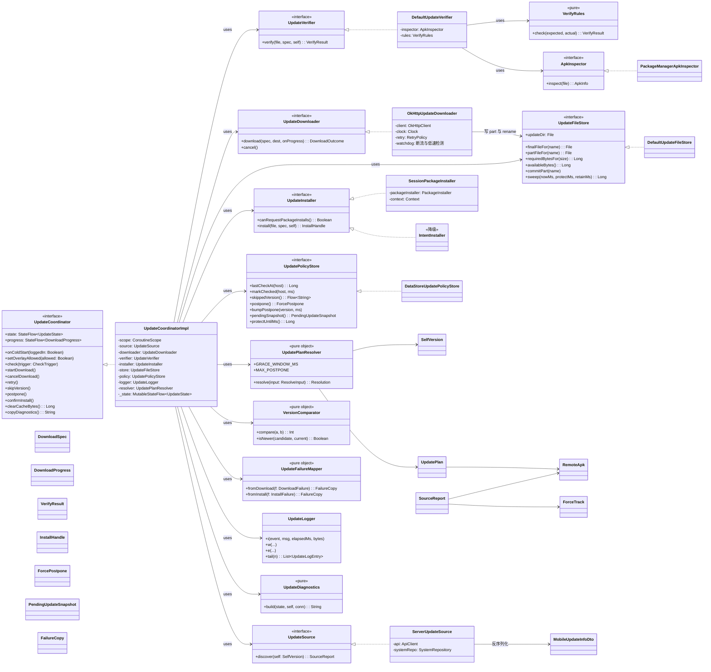
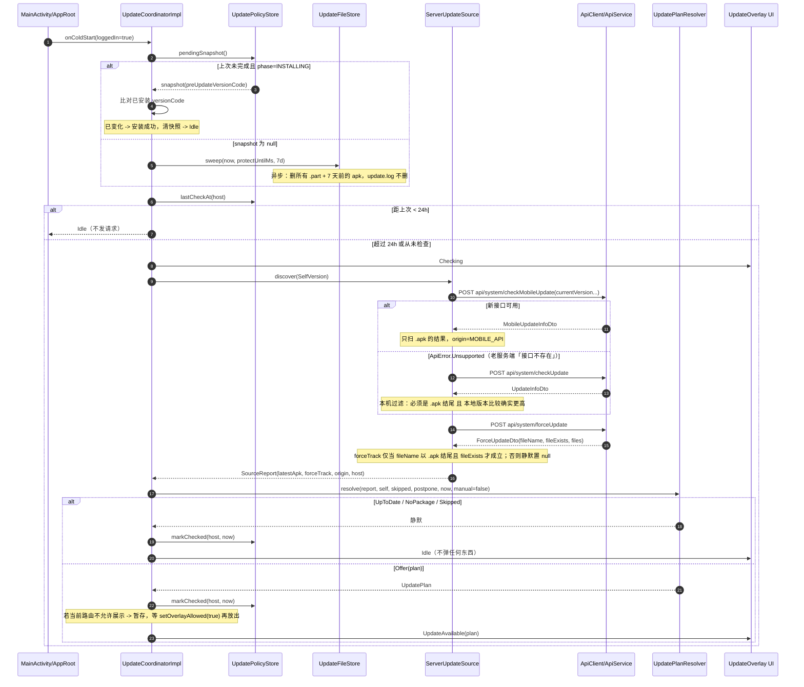
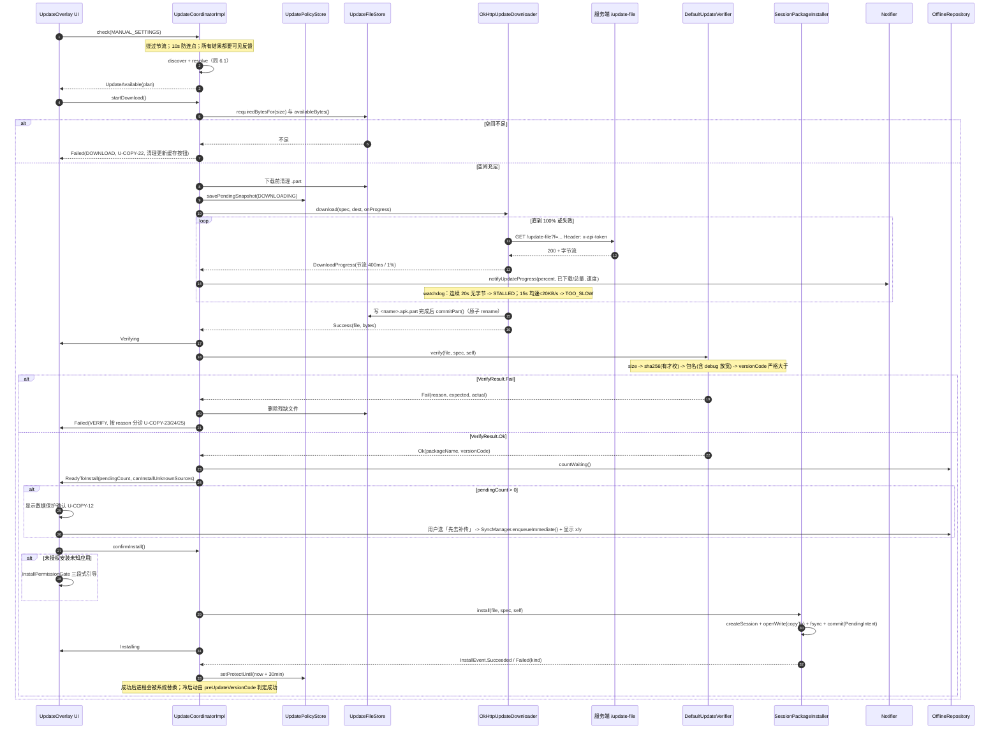
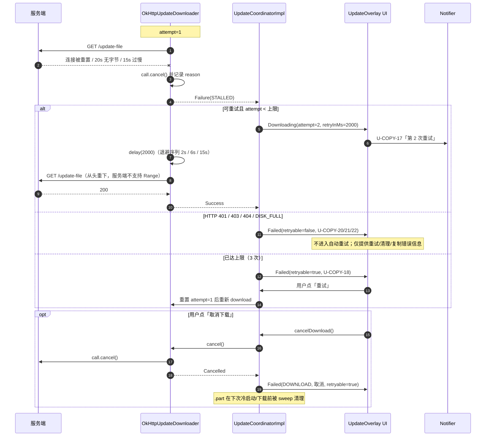
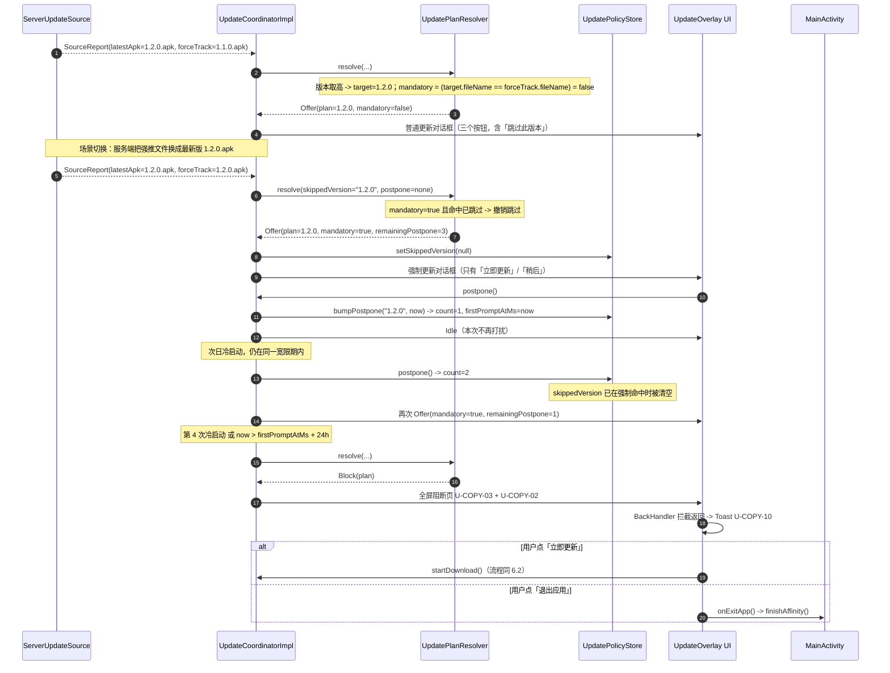
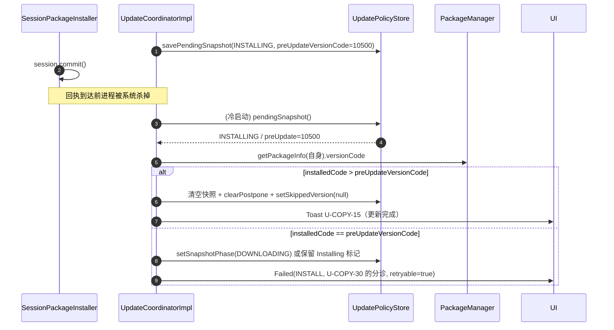
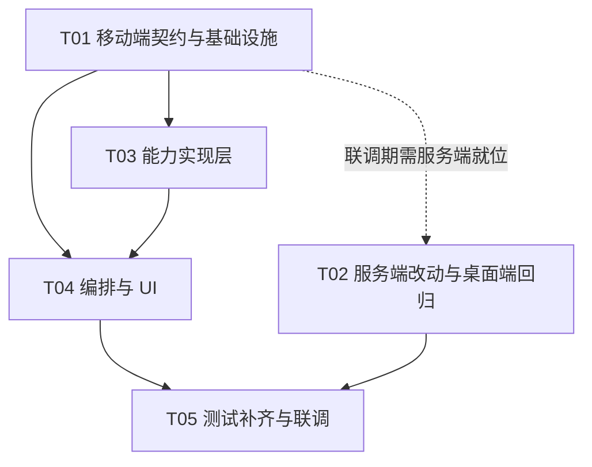

# 移动端内置在线更新 · 系统架构设计与任务分解

> 主战场：`xingqiyi-laundry-photo-android`（本地 `C:\build\xqy-android-repo`）
> 配套最小改动：`xingqiyi-laundry-photo` 桌面端/服务端（本地 `E:\软件开发\星期衣精致洗衣衣物照片系统`）
> 上游输入：`docs/mobile-updater-prd.md`（583 行，含 D1~D11 决策、U-01~U-30 需求池、35 条文案）
> 撰稿：高见远（架构师）· 面向移动端 `v1.1.0` 首次发版

---

## 一、实现方案与选型结论

### 1.1 需求的技术难点在哪

把 PRD 的 18 条 P0 翻译成技术问题，真正难的不是「下载一个文件」，而是下面五件事：

| # | 难点 | 为什么难 | 本设计的解法 |
|---|---|---|---|
| N1 | **跨端版本线串台** | 服务端更新文件夹里同时有桌面端 `.exe`(1.2.x) 和移动端 `.apk`(1.0.x)；现有 `checkUpdates()` 按「版本号最高」取**唯一**一个文件，返回的必然是 `.exe`。客户端连「存在一个 apk」都无从得知 | 服务端新增 `system/checkMobileUpdate` 专用接口（只扫 `.apk`）；客户端保留老接口降级。这是**唯一正确的修法**，纯客户端过滤在结构上不成立（论证见 PRD D1，此处不重复） |
| N2 | **下载必须逐字节可控** | 20~30MB APK + 门店 WiFi 抖动，需要：进度、即时取消、断流/低速检测、指数退避、错误分级 | 不放在 WorkManager，由 `UpdateCoordinator` 的应用级协程持有；自己实现看门狗与退避（见 §1.4） |
| N3 | **校验是安全的最后一道防线** | 服务端可能给错文件（`.exe`）、给老版本、给人家的 APK；且 sha256 可能缺失 | 四级校验，逐级可降级；「没有 sha256 就跳过哈希」是铁律，但**包大小 / 包名 / versionCode 三条永不降级** |
| N4 | **Release 包、混淆、FileProvider、安装回执** | 这四件事在 debug 与 JVM 单测里都测不出来，只在 release 真机暴露 | 全部走可注入接口 + 纯逻辑抽离；Release-only 的行为落成 guard 测试 + 手工回归清单（PRD §12 第 5 条） |
| N5 | **老服务端兼容** | 只升移动端不升桌面端的门店必须「零弹窗、零错误」 | 新接口返回 `ApiError.Unsupported`（服务端回「接口不存在」）→ `ServerUpdateSource` 静默降级到老接口 → 老接口结果必须是 `.apk` 且本地版本比较确实更高才成立 |

### 1.2 选型结论（逐条给理由）

| 关注点 | 选型 | 理由（含被否方案） |
|---|---|---|
| **下载调度载体** | 应用级 `CoroutineScope`（SupervisorJob + Dispatchers.IO），挂在 `AppContainer` | **否 WorkManager**：① WorkManager 的 `setProgress` 与 `CoroutineWorker` 适合「用户不看」的后台任务（补传），而更新是**用户当面盯着**的短任务，需要「点击即取消、秒级看到重试」；② WorkManager 的最小重试间隔受系统限制，做不出 2s→6s→15s 的自定义指数退避；③ 进程被杀 WorkManager 也救不了这套（没有持久化会话），不如显式落 `Failed(retryable)` 并让用户点重试——这是最诚实的行为。代价：熄屏 5 分钟可能被回收，接受（P1 U-22 再补前台 Service） |
| **HTTP 出口** | **独立的 `OkHttpClient` 实例**，由 `ApiClient.downloadClient()` 暴露 | **否「复用 Retrofit 那个」**：① 它挂了 `ResponseSnippetCaptureInterceptor`（`ApiClient.kt:118`），会把响应正文读进内存做脱敏——21MB APK 就是一颗内存炸弹；② 它 readTimeout 只有 60s，覆盖不了弱网大文件；③ 它带 `AuthInterceptor`（自动注入连接码），而下载请求的鉴权我们希望显式、可测。**否「把同一个实例直接导出」**：拿到的对象仍带那些拦截器 |
| **鉴权传输** | 连接码走 **`x-api-token` 请求头**，不进 URL | 实测确认 `server.js:220`：`handleUpdateFile` 同时接受 `x-api-token` 头与 `token` 查询参数，**头方式可用**（对比：`handleApi` 在 `server.js:76` 只读头，更强约束）。不进 URL 的原因：避免连接码出现在服务端 `http.createServer` 的请求行日志、抓包明文行与任何 Referer 上 |
| **文件落地目录** | **`filesDir/updates/`**（配合 backup 排除规则），详见 §3.3 | 在 `filesDir/updates`、`cacheDir/updates`、`noBackupFilesDir` 三者中权衡，最终选 `filesDir`：<br>· `cacheDir` **被否**——国内门店平板普遍装 360/腾讯手机管家类清理 App，一键清理会把下载好的 APK 抹掉；虽然状态机已有 `ReadyToInstall → Downloading（重下）` 兜底，但让用户眼睁睁重下一次体验很差<br>· `noBackupFilesDir` **被否**——它没有对应的 FileProvider 标签（`<files-path>/<cache-path>` 都指不到它），`ACTION_VIEW` 降级路径授权不出 content URI<br>· `filesDir` 的唯一副作用是 `allowBackup="true"` 会把 21MB APK 计入 Auto Backup 的 25MB 配额，可能把 Room 数据库挤出备份 → **用 `backup_rules.xml` + `data_extraction_rules.xml` 显式排除**（只增两个小 XML，成本远低于收益） |
| **安装主路径** | `PackageInstaller.Session` + 动态注册的回执 Receiver（`RECEIVER_NOT_EXPORTED`） | 相比 `ACTION_VIEW`：① 不需要 FileProvider 授权，不受 `file_paths.xml` 白名单约束；② 能拿到结构化的 `EXTRA_STATUS` 做精细化分诊（`CONFLICT`/`INCOMPATIBLE`/`STORAGE`…），而 ACTION_VIEW 只能看到「安装没起来」；③ 能拿到 install 完成的确定性回执。降级到 ACTION_VIEW 仅用于 Session 打开/写入抛异常时（部分 ROM 的 PackageInstaller 实现有坑） |
| **校验的内部实现** | 抽 `ApkInspector` 接口（`PackageManager.getPackageArchiveInfo`） | `DefaultUpdateVerifier` 组合 `ApkInspector` + 摘要器 + 纯规则类 `VerifyRules`；规则类不碰 Android → JVM 纯单测可全覆盖。这是 U-18「至少 4 个不依赖 Android 的纯逻辑单测」的主要来源 |
| **状态管理** | `UpdateCoordinator` 持有 `StateFlow<UpdateState>` | UI 只认状态不认流程；`StateFlow` 天然解决旋屏/跳转/退出设置页不中断下载。UI 层不再持有 ViewModel 里的下载 Job |
| **DTO 位置** | **只放 `data.model`**，update 包里不出现任何 Gson 序列化对象 | 项目铁律（PRD §5 工程约定 1）：`ProguardKeepRuleTest.dtoPackages` 只断言 `data.model` 与 `data.local`。为此**故意把冷启动恢复用的 Plan 用扁平字段持久化（不做 JSON）**，避免引入第二个需要 keep 的包。详见 §4.6 |
| **UI 形态** | `AppRoot` 之上的**全屏浮层 `UpdateOverlay`**，不进 NavHost 路由 | 从任何页面、从通知点击回来都能展示；不打断拍照/连拍页（由 UI 主动告知 Coordinator「当前路由是否允许展示」实现延后） |

### 1.3 依赖方向（单向，不可反向）

```
ui/update  ──▶  UpdateViewModel  ──▶  UpdateCoordinator(interface)
                                          │
                      ┌───────────────────┼────────────────────┬──────────────┐
                      ▼                   ▼                    ▼              ▼
               UpdateSource      UpdateDownloader       UpdateVerifier  UpdateInstaller
                      │                   │                    │              │
                      └────▶ ApiService ◀─┘          ApkInspector      PackageInstaller
                                          UpdateFileStore / UpdatePolicyStore / UpdateLogger（基础设施）
```

红线：**UI 层不得直接持有 OkHttp、`PackageInstaller`、`StatFs`，也不得直接调用除 `Context` 之外的任何系统服务**。任何 Android 框架依赖都必须夹在接口后面，并由构造注入。

### 1.4 「为什么 Downloader 要自己写看门狗」

OkHttp 在 `buildService` 里配了 `readTimeout(60s)`。给下载套一个「更大的 readTimeout」看似够了，实测不可靠：
- OkHttp 的 `readTimeout` 语义是**单次 read IO 的时间上限**，但不同 OkHttp 版本对 body 读流的包裹行为不一致，**不能把「20s 无字节」这个产品需求押注在框架语义上**；
- 更糟的是：即便超时抛出 `SocketTimeoutException`，你也**不知道**是因为「20s 一个字节没来」还是「整体超过了某个阈值」。

因此本设计的做法是：**OkHttp readTimeout 故意放长到 5 分钟**作为最后兜底，真正的判定由我们自己实现：

```
speedMeter / lastByteAt —— 每读一个 chunk 都更新
watchdog 协程：每 2s 轮询一次
  ├─ now - lastByteAt > 20_000          → DownloadFailure.STALLED
  └─ 最近 15s 平均速度 < 20KB/s 且 > 0   → DownloadFailure.TOO_SLOW
判定成立 → call.cancel() → enqueue 的 onFailure 收到由此产生的 IOException → 翻译成我们记录的原因
```

`Clock`（`SystemClock.elapsedRealtime` 封装）与阈值全部构造函数注入 → JVM 单测可用 `kotlinx-coroutines-test` 的虚拟时钟精确验收「20s 判失败」。这是本次可测性设计里最关键的一处。

---

## 二、模块划分与六大接口定义（对应 U-18）

> 全部集中在 `update/UpdateContract.kt`（接口 + 值对象），各角色的默认实现分散在 `update/` 包下的同名文件。Kotlin 签名含 `suspend` / `Flow` / 回调类型，可直接照抄。

### 2.1 通用值对象

```kotlin
/** 本 App 自身的版本身份。全部来自 BuildConfig，可注入以便单测。 */
data class SelfVersion(
    /** BuildConfig.VERSION_NAME；debug 构建形如 "1.0.0-debug" */
    val versionName: String,
    /** BuildConfig.VERSION_CODE（单调正整数，Android 的权威值） */
    val versionCode: Int,
    /** BuildConfig.APPLICATION_ID；debug 构建为 "com.xingqiyi.laundryphoto.debug" */
    val packageName: String,
    /** BuildConfig.RELEASE_APPLICATION_ID（新增 buildConfigField，两个 variant 同值） */
    val releasePackageName: String,
    val isDebug: Boolean
) {
    /** 参与版本比较的形式：去掉 "-debug" 之类后缀后的 "1.0.0" */
    val comparableName: String get() = versionName.substringBefore('-')
}

/** 服务端下发的候选 APK 描述（与来源是新接口还是老接口无关） */
data class RemoteApk(
    val fileName: String,       // "xingqiyi-laundry-photo-android-1.1.0.apk"
    val versionName: String,    // "1.1.0"
    val sizeBytes: Long,        // 0 表示服务端没给，跳过大小校验
    val sha256: String,         // 64 位小写 hex；空串表示没有，跳过哈希校验
    val notes: String,          // 已截断 2000 字符
    val notesSource: String     // "md" / "json" / "" ，仅用于日志
)

enum class UpdateOrigin { MOBILE_API, LEGACY_CHECK_UPDATE, FORCE_UPDATE, NONE }

enum class UpdateStage { CHECK, DOWNLOAD, VERIFY, INSTALL }
```

### 2.2 `UpdateSource` —— 版本发现

```kotlin
/**
 * 更新发现源。
 *
 * 职责边界：**一次性回答「这台服务器上，对我而言有什么」**，包含可选轨与强制轨两个信息，
 * 内部封装「新接口 → 老接口」的降级与「强推的是 .exe 就当没看见」的防御。
 * 编排器不做任何 API 选择决策。
 */
interface UpdateSource {
    @Throws(ApiError::class)
    suspend fun discover(self: SelfVersion): SourceReport
}

data class SourceReport(
    /** 可选轨最新 APK；null 表示这台服务器没有可用的手机版安装包 */
    val latestApk: RemoteApk?,
    /** 管理员强推且强推文件确实是个 APK（.apk 结尾且 fileExists），否则 null */
    val forceTrack: ForceTrack?,
    /** 本次可选轨信息是通过哪个通道拿到的，用于日志与 U-COPY-32 的判断 */
    val origin: UpdateOrigin,
    /** 服务器 host（含端口），用于节流分键 */
    val serverHost: String
)

data class ForceTrack(val fileName: String, val version: String, val fileExists: Boolean)
```

**可扩展点**：
- 接 GitHub Release / CDN：新写一个 `HttpReleaseUpdateSource`，`forceTrack` 恒为 null，`origin` 自定义一个值即可，`UpdatePlanResolver` 完全不用改；
- 接增量包/ABI 分包（P2 U-27/U-30）：把 `RemoteApk` 换成 `RemotePackage` 密闭家族（全量 / 差分），改的是这一个接口的返回类型，编排层只在 `UpdateFileStore` 多一个「合成输出」步骤。

### 2.3 `UpdateDownloader` —— 下载

```kotlin
data class DownloadSpec(
    val fileName: String,
    /** 完整下载 URL（不含连接码） */
    val url: String,
    val expectedBytes: Long,   // -1 表示未知
    val sha256: String,        // 空串 = 无
    /** 额外请求头；连接码由调用方以 x-api-token 注入，不由本类决定 */
    val headers: Map<String, String>
)

data class DownloadProgress(
    val bytesRead: Long,
    val totalBytes: Long,   // -1 未知
    val percent: Int,       // 0..100，**保证单调不减**（发出节流回调之前先用 max 兜住）
    val bytesPerSec: Long,
    val attempt: Int        // 第几次尝试，1-based
)

enum class DownloadFailure {
    DNS, CONNECT_TIMEOUT, READ_TIMEOUT, CONNECTION_RESET, IO,
    STALLED,       // 连续 20s 未收到任何字节
    TOO_SLOW,      // 连续 15s 平均 < 20KB/s
    HTTP_401, HTTP_403, HTTP_404, HTTP_5XX, HTTP_OTHER,
    DISK_FULL
}

sealed class DownloadOutcome {
    data class Success(val file: File, val bytesRead: Long) : DownloadOutcome()
    data class Failure(
        val kind: DownloadFailure,
        val httpCode: Int?,
        val message: String
    ) : DownloadOutcome()
    data object Cancelled : DownloadOutcome()
}

interface UpdateDownloader {
    /**
     * @param dest        最终文件路径；本方法内部先写 dest.part，成功后再原子 rename
     * @param onProgress  已节流（≥400ms 或百分比变化 ≥1%）的回调，可安全直接驱动 Compose
     * @return 永不抛异常；所有失败收敛为 DownloadOutcome.Failure
     */
    suspend fun download(
        spec: DownloadSpec,
        dest: File,
        onProgress: suspend (DownloadProgress) -> Unit
    ): DownloadOutcome

    fun cancel()
}
```

**可扩展点**：断点续传（P1 U-20）只需在 `DownloadSpec` 加 `rangeStart: Long` 并在实现里加 `If-Range` 头，接口不变；换成 DownloadManager / gRPC 流同理。

### 2.4 `UpdateVerifier` —— 校验

```kotlin
enum class VerifyFailure {
    IO, NOT_AN_APK, SIZE_MISMATCH, HASH_MISMATCH, PACKAGE_MISMATCH, VERSION_NOT_NEWER
}

sealed class VerifyResult {
    data class Ok(
        val packageName: String,
        val versionCode: Long,
        val sizeBytes: Long
    ) : VerifyResult()

    data class Fail(
        val failure: VerifyFailure,
        /** 期望值（人类可读），直接进「复制错误信息」 */
        val expected: String,
        val actual: String,
        val cause: Throwable? = null
    ) : VerifyResult()
}

interface UpdateVerifier {
    /**
     * 四级校验，顺序不可变（先便宜的、先信息量大的）：
     *   1. size         —— 服务端给了且 != 0 才校；否则跳过（不阻断）
     *   2. sha256       —— 服务端给了才校；否则跳过（不阻断）
     *   3. packageName  —— 必须等于 SelfVersion.packageName；debug 构建额外允许 releasePackageName
     *   4. versionCode  —— 必须**严格大于** SelfVersion.versionCode
     * 1、2 可跳过，3、4 永不跳过。失败时**调用方负责删除文件**。
     */
    suspend fun verify(file: File, spec: RemoteApk, self: SelfVersion): VerifyResult
}
```

### 2.5 `UpdateInstaller` —— 安装

```kotlin
enum class InstallFailure {
    BLOCKED,        // 多半是「不允许安装未知应用」
    CONFLICT,       // 签名/包名冲突：卸载会丢照片，必须警告
    INCOMPATIBLE,   // 系统版本或硬件不支持
    INVALID,        // 包损坏或版本更旧
    STORAGE,        // 空间不足
    ABORTED,        // 用户取消
    UNKNOWN,
    RECEIPT_LOST    // 进程在回执前被杀，冷启动兜底判定
}

sealed class InstallEvent {
    data object Pending : InstallEvent()
    data object Installing : InstallEvent()
    data object Succeeded : InstallEvent()
    data class Failed(val kind: InstallFailure, val rawStatus: Int, val message: String) : InstallEvent()
}

/** 一次安装会话的句柄：可取消、可流式观察回执 */
class InstallHandle(
    val sessionId: Int?,
    val events: kotlinx.coroutines.flow.Flow<InstallEvent>,
    private val onCancel: () -> Unit
) {
    fun cancel() = onCancel()
}

interface UpdateInstaller {
    /** 是否已获得「安装未知应用」授权。false 不代表失败，而是需要走权限引导（U-11） */
    fun canRequestPackageInstalls(): Boolean

    /**
     * 递交 APK 给系统。非阻塞：本方法返回时只是「会话已创建并提交」，
     * 真正结果通过 [InstallHandle.events] 异步送达；成功后进程会被系统替换。
     */
    fun install(file: File, spec: RemoteApk, self: SelfVersion): InstallHandle
}
```

### 2.6 `UpdatePolicyStore` —— 策略持久化

```kotlin
data class ForcePostpone(
    val forceVersion: String,   // 推迟计数归属于哪个强推版本；版本变化自动清零
    val count: Int,
    val firstPromptAtMs: Long
)

/** 冷启动恢复用的轻量快照：**刻意用扁平字段而非 JSON**，见 §4.6 */
data class PendingUpdateSnapshot(
    val phase: UpdateStage,
    val fileName: String, val version: String, val sizeBytes: Long,
    val sha256: String, val notes: String, val notesSource: String,
    val mandatory: Boolean, val forceVersion: String,
    val startedAtMs: Long,
    val preUpdateVersionCode: Int   // 用于「回执丢失时比对已安装版本判断是否成功」
)

interface UpdatePolicyStore {
    // ---- 冷启动节流（D6：>24h，按服务器 host 分键） ----
    suspend fun lastCheckAt(serverHost: String): Long
    suspend fun markChecked(serverHost: String, atMs: Long)

    // ---- 跳过此版本（D5）----
    fun skippedVersion(): kotlinx.coroutines.flow.Flow<String>
    suspend fun setSkippedVersion(version: String?)

    // ---- 强制更新宽限（D4）----
    suspend fun postpone(): ForcePostpone
    suspend fun bumpPostpone(forceVersion: String, nowMs: Long): ForcePostpone
    suspend fun clearPostpone()

    // ---- 冷启动恢复 ----
    suspend fun pendingSnapshot(): PendingUpdateSnapshot?
    suspend fun savePendingSnapshot(s: PendingUpdateSnapshot?)
    suspend fun setSnapshotPhase(phase: UpdateStage)

    // ---- 安装后 30 分钟保护窗（U-14）----
    suspend fun protectUntilMs(): Long
    suspend fun setProtectUntil(ms: Long)
}
```

### 2.7 `UpdateCoordinator` —— 编排

```kotlin
enum class CheckTrigger { AUTO_BOOT, MANUAL_SETTINGS, RETRY_PROMPT }

interface UpdateCoordinator {
    /** 唯一真源。UI 只做状态 → 界面的纯映射 */
    val state: kotlinx.coroutines.flow.StateFlow<UpdateState>
    /** 下载进度（非下载态为 null）；与 state 分开是为了避免满屏重组 */
    val progress: kotlinx.coroutines.flow.StateFlow<DownloadProgress?>

    // ---- 生命周期 ----
    suspend fun onColdStart(loggedIn: Boolean)
    /** UI 告知当前路由是否允许弹窗（拍照/扫码/连拍 = false，实现 U-05 的「延后」） */
    fun setOverlayAllowed(allowed: Boolean)

    // ---- 用户动作 ----
    suspend fun check(trigger: CheckTrigger)
    fun startDownload()
    fun cancelDownload()
    fun retry()
    fun skipVersion()
    fun postpone()
    /** 数据保护确认后继续安装（U-13） */
    fun confirmInstall()
    fun dismissFailure()

    // ---- 运维 ----
    fun clearCacheBytes(): Long
    fun copyDiagnostics(): String
}
```

### 2.8 基础设施协作者（不属于六大角色，但被它们依赖）

```kotlin
/** 更新包的文件空间。**目录策略、StatFs、清理、保护窗全部收在这里** */
interface UpdateFileStore {
    val updateDir: File                       // filesDir/updates
    fun finalFileFor(fileName: String): File
    fun partFileFor(fileName: String): File
    /** 磁盘预检：可用空间需求 = size * 1.5 + 20MB（U-17） */
    fun requiredBytesFor(sizeBytes: Long): Long
    fun availableBytes(): Long                // StatFs
    /** 原子 rename；失败抛 IOException，调用方据此落 Verifying → Failed */
    @Throws(java.io.IOException::class)
    fun commitPart(fileName: String)
    /** 清理：所有 .part + 超过保留期的最终文件；[protectUntilMs] 内跳过忙于保护期的文件 */
    fun sweep(nowMs: Long, protectUntilMs: Long, retentionMs: Long): Long   // 返回释放的字节数
}

/** APK 内信息读取。抽出来是为了让「包名/versionCode 比对规则」纯 JVM 可测 */
interface ApkInspector {
    /** 读不到（不是 APK / IO 失败）返回 null */
    fun inspect(file: File): ApkInfo?
}
data class ApkInfo(val packageName: String, val versionCode: Long, val versionName: String?)

interface Clock { fun elapsedRealtime(): Long; fun currentTimeMillis(): Long }
```

---

## 三、关键架构决策的实现细节

### 3.1 下载出口：`ApiClient` 的改造（不变其职责边界）

在 `ApiClient.kt` 末尾追加，**不改动 `buildService()` 一行**：

```kotlin
@Volatile
private var downloadHttp: OkHttpClient? = null

/**
 * 专供「移动端更新包下载」的独立 OkHttpClient（懒创建、进程内复用）。
 *
 * ## 为什么必须独立，而不是复用给 Retrofit 配的那个
 *
 * 1. **内存炸弹**：Retrofit 那个实例挂了 ResponseSnippetCaptureInterceptor（见本文件 buildService），
 *    它会把响应正文读进内存做脱敏——对 21MB 的 APK 就是一次性吃进 21MB+ 的 String，
 *    低端门店平板（2GB RAM）上直接 OOM，而且是在用户正盯着进度条的时候崩。
 * 2. **读超时语义**：那里配的是 readTimeout 60s（为 3~8MB 照片上传设计）。
 *    下载场景下，把「20s 无字节」这个产品需求押在 OkHttp 的 readTimeout 语义上不可靠
 *    （不同版本对 body 源流的包裹行为不一致），因此这里给它 5 分钟作底线，
 *    真正的断流/低速判定由 OkHttpUpdateDownloader 自己的看门狗负责（20s / 15s）。
 * 3. **鉴权**：这里**故意不放 AuthInterceptor**。下载请求的令牌由 UpdateDownloader
 *    在发起时从 SessionHolder 显式取出注入，避免「 OkHttp 实例持有过期令牌」这种状态泄漏。
 * 4. **不重试**：retryOnConnectionFailure(false)。重试编排（3 次、2s→6s→15s 指数退避、
 *    按错误类型分级）在我们自己的代码里，双重复试会变成 2×3 = 6 次，十几台手机一起重试就能打满门店 WiFi。
 */
fun downloadClient(): OkHttpClient = downloadHttp ?: synchronized(this) {
    downloadHttp ?: OkHttpClient.Builder()
        .connectTimeout(15, TimeUnit.SECONDS)
        .readTimeout(5, TimeUnit.MINUTES)
        .writeTimeout(30, TimeUnit.SECONDS)
        .retryOnConnectionFailure(false)
        .build()
        .also { downloadHttp = it }
}

/**
 * 更新包下载地址。**连接码刻意不进 URL**（与 photoUrl() 的做法不同）：
 * photoUrl 走查询参数是历史妥协（Coil 加不了请求头），下载是我们自己的代码，
 * 没有理由让连接码出现在服务端访问日志、抓包明文行和任何 Referer 上。
 * 实测 server.js handleUpdateFile() 支持 x-api-token 请求头，可行性已确认。
 */
fun updateFileUrl(fileName: String): String =
    if (baseUrl.isBlank()) "" else
        baseUrl + "/update-file?f=" + URLEncoder.encode(fileName, "UTF-8").replace("+", "%20")
```

### 3.2 版本比较一致性：`VersionComparator` 与 `store.js:1507` 逐条对齐

服务端 JS：

```js
const pa = String(a || '0').replace(/^v/i, '').split('.').map((n) => parseInt(n, 10) || 0);
const pb = String(b || '0').replace(/^v/i, '').split('.').map((n) => parseInt(n, 10) || 0);
for (let i = 0; i < Math.max(pa.length, pb.length); i++) {
  const x = pa[i] || 0;  const y = pb[i] || 0;
  if (x !== y) return x > y ? 1 : -1;
}
return 0;
```

必须逐条复刻的语义：

| JS 行为 | Kotlin 实现要点 | 反例（不做就是 bug） |
|---|---|---|
| `String(a \|\| '0')` | null/空白 → `"0"` | 服务端无 hasPackage 时 `version` 为 `""`，此处必须等价于 `"0"` |
| `replace(/^v/i, '')` | 去掉**开头一个** `v` 或 `V`（大小写不敏感） | 不能用 `removeSuffix`／不能用全部替换 |
| `split('.')` | 按 `.` 切，空段保留 | `"1..0"` → `["1","","0"]` |
| `parseInt(n, 10)` | **取前导数字**，遇非数字即止；支持前导 `-`；`"007"` → 7 | `"0-debug"` → `0`（JS parseInt），若用 Kotlin `toIntOrNull()` 会得到 null→0，结果相同但语义不同：`"12-hotfix"` JS 得 12，`toIntOrNull` 得 null。**必须用正则取前导数字**才是真对齐 |
| `\|\| 0` | NaN → 0 | `"abc"` → 0 |
| 缺位补 0 | 循环上界 `max(pa.length, pb.length)`，越界取 0 | `"1.2"` vs `"1.2.0"` 必须判等 |
| 返回值 | 1 / -1 / 0 | 与 `Comparator.compare` 符号约定一致，可直接当 Comparator 用 |

签名与关键片段：

```kotlin
object VersionComparator : Comparator<String> {
    private val LEADING_INT = Regex("^-?\\d+")

    override fun compare(a: String, b: String): Int { /* 对齐上表 */ }

    fun isNewer(candidate: String, current: String): Boolean = compare(candidate, current) > 0

    /**
     * 规范化：去掉开头的 v/V。**不**处理后缀（"-debug"）：
     * 后缀交给 SelfVersion.comparableName 处理，两者职责分开——
     * 若在这里也去掉后缀，`compare("1.0.0-debug","1.0.0")` 与服务端 compareVersions 的结果
     * 仍然一致（因为 JS 的 parseInt 同样会把 "0-debug" 读成 0），但会掩盖两者的语义差异，
     * 未来服务端一旦改用严格解析就会分叉。留在这里并配单测，是更诚实的做法。
     */
    fun normalize(v: String): String
}
```

**debug 后缀专项**：移动端 debug 包 `VERSION_NAME = "1.0.0-debug"`，服务端下发 `"1.0.0"`。
- `VersionComparator` 层面不需要特殊处理（两条语义都得到 0，即「不算更新」）。
- 真正的坑在**包名**，见 §3.5。
- `SelfVersion.comparableName`（去掉第一个 `-` 之后）用于 UI 展示与 `skippedVersion` 落盘，避免 debug 下跳过记录写成 `"1.0.0-debug"` 而正式包永远读不到。

### 3.3 文件存储路径策略

```
filesDir/updates/
    xingqiyi-laundry-photo-android-1.1.0.apk        ← 校验通过后 rename 得到的最终文件
    xingqiyi-laundry-photo-android-1.1.0.apk.part   ← 下载中的临时文件
    update.log                                       ← 滚动日志（最近 200 条）
```

四条约定：

1. **写 `.part` → `commitPart()` 原子 rename → 最终路径**。
   `File.renameTo` 在同一目录、同一文件系统上是原子的，是这里唯一可靠的「要么完整要么没有」手段。rename 失败（磁盘满、跨文件系统）按 IO 异常处理，落 `Failed(VERIFY)`。
2. **`ACTION_VIEW` 降级需要 FileProvider**（主路径 `PackageInstaller.Session` **不需要** —— 我们自己把字节写进 session）。
   `res/xml/file_paths.xml` 只加一条，**限制在 updates 子目录**：
   ```xml
   <files-path name="shared_updates" path="updates/" />
   ```
   不给 `<root-path>`、不给 `<external-path>`、不开放整个 filesDir。
3. **清理规则**（唯一实现位置：`UpdateFileStore.sweep(nowMs, protectUntilMs, retentionMs)`）
   - 删除**所有** `*.part`（冷启动、下载前、设置页手工清理都会调用）；
   - 删除 `lastModified() < now - 7d` 的 **`*.apk`**（只匹配 `.apk`，`update.log` 永不删）；
   - `nowMs < protectUntilMs` 时**跳过所有清理**（保护刚安装的文件，U-14）；
   - 调用点：① `LaundryApp.onCreate` → ioScope 异步冷启动清理；② 每次 `startDownload()` 之前；③ 设置页「清理更新缓存」；④ 安装会话 commit 成功后 → `setProtectUntil(now + 30min)`，**此时不删文件**。
4. **`allowBackup="true"` 的副作用必须堵**：新增 `backup_rules.xml`（Android ≤11）与 `data_extraction_rules.xml`（Android 12+），均 `<exclude domain="file" path="updates/"/>`，并在 Manifest 挂 `android:fullBackupContent` / `android:dataExtractionRules`。配一个 guard 测试 `BackupExclusionTest` 断言这两条规则存在。

### 3.4 磁盘预检（U-17）

```kotlin
requiredBytes = sizeBytes * 1.5 + 20L * 1024 * 1024   // 纯函数写在 SpaceRule 里，可单测
if (UpdateFileStore.availableBytes() < requiredBytes) → Failed(DOWNLOAD, DISK_FULL, retryable=false)
```
**必须在写第一个字节之前**判断；该路径上的失败文案（U-COPY-22）带「清理更新缓存」按钮。

### 3.5 debug 包的特殊性（本项目最容易踩的一颗雷）

| 事实 | 后果 |
|---|---|
| debug  variant `applicationIdSuffix = ".debug"` → `BuildConfig.APPLICATION_ID == "com.xingqiyi.laundryphoto.debug"` | 服务端 APK 的包名是 `com.xingqiyi.laundryphoto` → 校验第 3 条「包名必须等于 `APPLICATION_ID`」**会把自己的正式包判成别人的包**，debug 包 100% 装不了更新 |
| debug 一旦强行放过，因为是包名不同 ⇒ 系统视为**另一个应用**，会并列装出两个「星期衣衣物照片」 | 用户彻底困惑：桌面上两个图标，数据不互通 |

处理方案（三处，缺一不可）：

1. `build.gradle.kts` 新增编译期常量，两个 variant 同值：
   ```kotlin
   buildConfigField("String", "RELEASE_APPLICATION_ID", "\"com.xingqiyi.laundryphoto\"")
   ```
   （`BuildConfig.APPLICATION_ID` 会被 AGP 自动写成带后缀的值，所以必须另开一个。）
2. `DefaultUpdateVerifier` 的接受集：`setOf(self.packageName) + if (self.isDebug) setOf(self.releasePackageName) else emptySet()`。**只有 debug 放宽**，release 严格只认自己的包名——安全边界不因调试便利而松动。
3. `self.isDebug == true` 时，**确认对话框顶部显示一条 debug 提示条**（`U-COPY-36`，正式包永不显示），文案说明「当前是调试版，更新会并列安装正式版 App；正式发布的 App 不受此影响」，避免工程师自己都搞混。日志里同样打标 `self=DEBUG`。

### 3.6 进程被杀后的状态恢复

**不持久化完整状态**，只持久化三样扁平信息（`UpdatePolicyStore`）：

| key | 谁写 | 用途 |
|---|---|---|
| `pending_*`（`PendingUpdateSnapshot`） | 进入 Downloading 时写完整快照；Verifying/ReadyToInstall/Installing 时 `setSnapshotPhase()` | 冷启动知道「上次在做什么、目标是什么」，才能给出「失败可重试」而不是「什么都没发生」 |
| `pending_phase` | 同上 | 决定恢复到哪个状态 |
| `protect_until_ms`、`pre_update_code` | 安装提交前后 | 保护 / 回执丢失时的成功判定 |

冷启动 `onColdStart(loggedIn)` 的判定顺序（**顺序不可换**）：

```
1. installedCode != snapshot.preUpdateVersionCode && snapshot.phase == INSTALLING
   → 认为安装成功 → 清空快照 + IDLE +  Toast U-COPY-15
2. snapshot == null
   → 正常冷启动（走节流检查）+ 异步 sweep
3. snapshot.phase == DOWNLOADING
   → 删除所有 .part → Failed(DOWNLOAD, STALLED, retryable=true)（保留快照，点「重试」直接用它的 Plan）
4. snapshot.phase == VERIFYING / READY_TO_INSTALL
   → 若最终文件存在且大小匹配 → 回到 ReadyToInstall（带上 pending 数）
     否则 → 删除快照 → Failed(VERIFY, ..., retryable=true)
5. snapshot.phase == INSTALLING（且步骤 1 未命中）
   → Failed(INSTALL, RECEIPT_LOST, retryable=true)（即 U-10 表的「回执丢失」兜底）
```

> **为什么冷启动恢复不依赖「有没有 .part 文件」**：那样做会让「清理」和「恢复推断」抢同一份信息，二者必须严格串行，任何一次调用顺序调整（比如清理改成异步、或加个 `MainScope`）都会悄悄改掉恢复语义。改为读 DataStore 的显式快照后，两者彻底解耦——这是本设计里我最坚持的一条。

### 3.7 UI 与 Coordinator 的边界

- `UpdateOverlay` 挂在整个 `AppRoot` 的 Scaffold 之上（非 NavHost 内），按 `state` 分派到对应界面；
- `MainActivity` 观察当前路由，命中 `{SCAN, BURST, CAPTURE}`（扫码/连拍/拍照）时调用 `coordinator.setOverlayAllowed(false)`；回到安全路由时置回 `true`，此时未被消费的 offer 立即弹出（实现 D6 第 4 条「延后」）；
- 状态由 Coordinator 单向流出后，UI 只做纯映射，**浮层内部不做任何业务分支**。

---

## 四、数据结构与状态模型

### 4.1 `UpdateState`（密闭类，PRD §8.1 的落地）

```kotlin
sealed class UpdateState {
    data object Idle : UpdateState()
    data object Checking : UpdateState()

    data class UpdateAvailable(
        val plan: UpdatePlan,
        val mandatory: Boolean,          // 冗余自 plan，方便 Compose 少解一层
        val previouslySkipped: Boolean,  // 决定是否显示 U-COPY-33
        val remainingPostpone: Int,
        val graceEndsAtMs: Long
    ) : UpdateState()

    data class Blocked(val plan: UpdatePlan) : UpdateState()

    data class Downloading(
        val plan: UpdatePlan,
        val attempt: Int,
        val retryInMs: Long?            // 非 null 表示正在退避等待（显示 U-COPY-17）
    ) : UpdateState()

    data class Verifying(val plan: UpdatePlan) : UpdateState()

    data class ReadyToInstall(
        val plan: UpdatePlan,
        val pendingCount: Int,          // >0 才显示数据保护确认
        val canInstallUnknownSources: Boolean
    ) : UpdateState()

    data class Installing(val plan: UpdatePlan) : UpdateState()

    data class Failed(
        val stage: UpdateStage,
        val copy: FailureCopy,          // ← 见 4.2
        val plan: UpdatePlan?           // 重试需要它
    ) : UpdateState()
}

/** 失败文案与重试策略的**纯数据**，由 UpdateFailureMapper 产生，便于单测 */
data class FailureCopy(
    val stringRes: Int,                 // 语义化 string 资源 id
    val formatArgs: List<String>,
    val retryable: Boolean,
    val promoteCleanCache: Boolean      // 磁盘不足时把「重试」换成「清理更新缓存」
)
```

### 4.2 `UpdatePlan`

```kotlin
data class UpdatePlan(
    val target: RemoteApk,
    val mandatory: Boolean,
    val origin: UpdateOrigin,
    val discoveredAtMs: Long,
    /** 管理员强推的版本号，空串表示本次没有强推轨 */
    val forceVersion: String,
    /** 剩余可推迟次数（0 表示不能再推迟） */
    val remainingPostpone: Int,
    /** 宽限期截止时间戳（firstPromptAt + 24h），仅 mandatory 时有意义 */
    val graceEndsAtMs: Long
)
```

### 4.3 `UpdateLogEntry`（U-15）

```kotlin
data class UpdateLogEntry(
    val atIso: String,           // ISO-8601 UTC，"2025-08-16T09:12:33.102Z"
    val level: Char,             // 'I' / 'W' / 'E'
    val tag: String,             // 恒为 "XqyUpdate"
    val event: String,           // CHECK_START / DISCOVERED / RETRY / VERIFY_RESULT / INSTALL_RECEIPT ...
    val message: String,         // **已脱敏**：绝不出现连接码、会话令牌
    val elapsedMs: Long?,        // 关键节点耗时
    val bytes: Long?             // 关键节点字节数
)
```
滚动策略：`update.log` 追加写，行数 > 200 时保留后 200 行重写一次（写 mutex 保证串行）。

### 4.4 `UpdatePlanResolver`（纯函数，编排的核心）

```kotlin
/**
 * 「可选轨」与「强制轨」的合并规则（PRD D4）。**纯 Kotlin，不依赖任何 Android 类**，
 * 整个 Resolve 过程可被 JVM 单测穷举覆盖。
 */
object UpdatePlanResolver {
    fun resolve(input: ResolveInput): Resolution

    companion object {
        const val GRACE_WINDOW_MS = 24L * 60 * 60 * 1000
        const val MAX_POSTPONE = 3
    }
}

data class ResolveInput(
    val report: SourceReport,
    val self: SelfVersion,
    val skippedVersion: String,
    val postpone: ForcePostpone,
    val nowMs: Long,
    /** 手动检查为 true：绕过节流与跳过命中（但仍要报告 previouslySkipped，用于 U-COPY-33） */
    val manual: Boolean
)

sealed class Resolution {
    data class Offer(val plan: UpdatePlan, val previouslySkipped: Boolean) : Resolution()
    data class Block(val plan: UpdatePlan) : Resolution()
    data object UpToDate : Resolution()
    data object NoPackage : Resolution()
    data object Skipped : Resolution()          // 命中跳过且不阻断 → 静默
    data object NotConfigured : Resolution()
}
```

规则表（**这是 U-04 的验收口径，必须逐条有单测**）：

| 输入组合 | 结果 |
|---|---|
| `latestApk == null && forceTrack == null` | `NoPackage` → 静默（这是正常状态，不是错误，不打扰正在上货的店员） |
| `latestApk != null`，客户端本地比较 `isNewer(target.versionName, self.comparableName)` 为 false | `UpToDate` → 手动检查时 Snackbar U-COPY-05 |
| 有更新，且 `target.versionName == skippedVersion` | `Skipped`（自动检查静默；手动检查 → `Offer(previouslySkipped=true)` 显示 U-COPY-33） |
| `forceTrack != null` 且 `forceTrack.fileName != latestApk.fileName` | `Offer(mandatory = false)` —— 更新到最新版但**不强制**（强推版本比最新版旧） |
| `forceTrack != null` 且 `forceTrack.fileName == latestApk.fileName` | `mandatory = true`，且**撤销**该版本的 `skippedVersion` |
| `forceTrack == null` | `Offer(mandatory = false)` |
| mandatory 且 `postpone.count >= MAX_POSTPONE` 或 `nowMs > postpone.firstPromptAtMs + GRACE_WINDOW_MS` | `Block` → 全屏阻断页 |
| mandatory 但未到限 | `Offer(mandatory=true, remainingPostpone = MAX_POSTPONE - count)` |
| `forceTrack.fileName` 不以 `.apk` 结尾（管理员误推 exe） | `SourceReport.forceTrack` 在 `ServerUpdateSource` 阶段就已置 null → 落到普通可选轨，**移动端完全无感**（U-04①） |

### 4.5 `UpdateFailureMapper`（纯函数）

| DownloadFailure | string 资源 | retryable | 自动重试上限 |
|---|---|---|---|
| DNS / CONNECT_TIMEOUT / READ_TIMEOUT / CONNECTION_RESET / IO | `update_err_network`（U-COPY-18） | ✅ | 3 |
| STALLED | `update_err_stalled`（U-COPY-18） | ✅ | 3 |
| TOO_SLOW | `update_err_too_slow`（U-COPY-19） | ✅ | 3 |
| HTTP_401 / HTTP_403 | `update_err_auth`（U-COPY-20） | ❌ | 1 |
| HTTP_404 | `update_err_missing`（U-COPY-21） | ❌ | 1 |
| HTTP_5XX | `update_err_server`（U-COPY-18） | ✅ | 2 |
| HTTP_OTHER | `update_err_server` | ✅ | 2 |
| DISK_FULL | `update_err_space`（U-COPY-22，`promoteCleanCache=true`） | ❌ | 1 |

InstallFailure → U-COPY-15 / 09 / 26 / 27 / 25 / 22 的映射同表（见 PRD U-10 分诊表），同样收在这个类里，便于一张表全览。

### 4.6 为什么 `PendingUpdateSnapshot` 刻意不用 JSON

`ApiError` 的血泪教训是「Gson + R8 剥字段」。若把 Plan 序列化成 JSON 存 DataStore，就相当于把 `UpdatePlan`/`RemoteApk` 变成了**第二个 Gson 包**，必须：
① 把 `com.xingqiyi.laundryphoto.update.model` 加进 `ProguardKeepRuleTest.dtoPackages`；
② 在 proguard 里加一条 `-keep class ...update.model.** { *; }`。

两个选择摆在面前：**改守卫测试**，还是**不用 JSON**。本项目选后者 —— 快照只有 9 个字段，用 9 个扁平 preference key 存，多写 12 行代码，换来：
- 不新增 keep 规则、不改守卫测试（**不碰历史上出过事的那道防线**）；
- 冷启动反序列化不可能因为字段改名而静默拿到 null（`XXX||0` 那类事故在这里永不会发生）；
- `data.remote` 之外没有第二个 Gson 使用者。

同理，`UpdatePolicyStore` 的推迟状态用 `postpone_version/count/first_at_ms` 三个 key，节流用 `last_check_host` + `last_check_at_ms` 两个 key，一律不存 JSON。

> 取舍声明：`last_check` 只记一个 host 的量 —— 换到新服务器时 host 不匹配 ⇒ 视为从未检查 ⇒ 立即检查，这恰好满足 PRD D6「换服务器不互相干扰」的核心意图；代价是在两台服务器间来回切换时 24h 节流会被打破。门店场景中每台手机只配一个服务器，接受此简化（需要时改动仅限 `DataStoreUpdatePolicyStore` 一个文件）。

---

## 五、类图



---

## 六、时序图

### 6.1 冷启动自动检查 → 发现可选更新（对应 D6 / U-03 / U-05）



### 6.2 手动检查 → 下载 → 校验 → 安装（对应 U-06 / U-07 / U-09 / U-10 / U-13）



### 6.3 失败重试与取消（对应 D11 / U-08）



### 6.4 强制更新：合并、跳过失效、宽限耗尽到阻断（对应 D4 / D5 / U-04 / U-12）



### 6.5 补充：安装回执丢失与冷启动恢复（对应 §3.6）



---

## 七、文件清单

### 7.1 移动端仓库（`C:\build\xqy-android-repo`）

| # | 相对路径 | 状态 | 职责（一句话） |
|---|---|---|---|
| 1 | `app/build.gradle.kts` | 改 | 新增 `buildConfigField("String","RELEASE_APPLICATION_ID")`（debug 包名校验用）；（可选）新增 mockwebserver 测试依赖 |
| 2 | `app/src/main/AndroidManifest.xml` | 改 | 新增 `REQUEST_INSTALL_PACKAGES`；挂 `fullBackupContent` / `dataExtractionRules` |
| 3 | `app/src/main/res/xml/file_paths.xml` | 改 | 新增受限的 `<files-path name="shared_updates" path="updates/"/>` |
| 4 | `app/src/main/res/xml/backup_rules.xml` | **新** | Android ≤11 备份规则：排除 `updates/` |
| 5 | `app/src/main/res/xml/data_extraction_rules.xml` | **新** | Android 12+ 备份/迁移规则：同上 |
| 6 | `app/src/main/res/values/strings.xml` | 改 | U-COPY-01~35 + `channel_update_name/desc` + 本文设计的 `update_copy_debug`（U-COPY-36） |
| 7 | `app/src/main/java/.../data/model/Models.kt` | 改 | 新增 `MobileUpdateInfoDto`；`UpdateInfoDto` 补 `latestFile`；`ForceUpdateDto` 补 `fileExists/files`（全部字段可空 + 兜底计算属性） |
| 8 | `app/src/main/java/.../data/remote/ApiService.kt` | 改 | 新增 `checkMobileUpdate(body)` |
| 9 | `app/src/main/java/.../data/remote/ApiClient.kt` | 改 | 新增 `downloadClient()` 与 `updateFileUrl()`（**不改 buildService**） |
| 10 | `app/src/main/java/.../update/UpdateContract.kt` | **新** | 六大接口 + 全部值对象（`SelfVersion/RemoteApk/UpdatePlan/DownloadSpec/DownloadProgress/VerifyResult/InstallHandle/DownloadOutcome/UpdateState/FailureCopy/SourceReport/ForceTrack/PendingUpdateSnapshot/ForcePostpone`） |
| 11 | `app/src/main/java/.../update/VersionComparator.kt` | **新** | 与 `store.js:1507` 逐条对齐的纯版本比较器 |
| 12 | `app/src/main/java/.../update/UpdatePlanResolver.kt` | **新** | 纯逻辑：可选轨/强制轨合并、跳过命中、推迟计数、宽限判定 |
| 13 | `app/src/main/java/.../update/UpdateFailureMapper.kt` | **新** | 纯逻辑：错误分级 → 文案资源 + 是否可重试 + 重试上限 |
| 14 | `app/src/main/java/.../update/ServerUpdateSource.kt` | **新** | `UpdateSource` 默认实现：新接口 → 老接口降级 + forceUpdate 轨的 `.apk` 防御 |
| 15 | `app/src/main/java/.../update/OkHttpUpdateDownloader.kt` | **新** | `UpdateDownloader` 默认实现：写 `.part`、rename、进度节流、断流/低速看门狗、指数退避、取消 |
| 16 | `app/src/main/java/.../update/UpdateFileStore.kt` | **新** | 接口 + `DefaultUpdateFileStore`：目录、`.part`、原子 rename、`StatFs`、清理与保护窗 |
| 17 | `app/src/main/java/.../update/DefaultUpdateVerifier.kt` | **新** | `UpdateVerifier` 默认实现：size → sha256 → 包名 → versionCode |
| 18 | `app/src/main/java/.../update/ApkInspector.kt` | **新** | `ApkInspector` 接口 + `PackageManagerApkInspector` + 纯规则 `VerifyRules` + `SpaceRule` |
| 19 | `app/src/main/java/.../update/SessionPackageInstaller.kt` | **新** | `UpdateInstaller` 默认实现：Session 主路径 + `IntentInstaller` 降级 + 动态回执 Receiver |
| 20 | `app/src/main/java/.../update/DataStoreUpdatePolicyStore.kt` | **新** | `UpdatePolicyStore` 默认实现（独立 DataStore `xqy_update`，扁平 key，无 JSON） |
| 21 | `app/src/main/java/.../update/UpdateLogger.kt` | **新** | Logcat `XqyUpdate` + `update.log` 滚动 200 条 + 脱敏 |
| 22 | `app/src/main/java/.../update/UpdateDiagnostics.kt` | **新** | 纯逻辑：「复制错误信息」文本组装（错误类型 + HTTP 状态 + 日志末尾 20 行） |
| 23 | `app/src/main/java/.../update/UpdateCoordinatorImpl.kt` | **新** | 状态机、角色装配、节流、合并、冷启动恢复 |
| 24 | `app/src/main/java/.../di/AppContainer.kt` | 改 | 装配上述全部依赖、提供 `updateIoScope`、冷启动清理入口 |
| 25 | `app/src/main/java/.../laundryphoto/LaundryApp.kt` | 改 | `onCreate` 触发一次异步更新缓存清理 |
| 26 | `app/src/main/java/.../ui/update/UpdateOverlay.kt` | **新** | 全屏浮层宿主：按 `UpdateState` 分派 |
| 27 | `app/src/main/java/.../ui/update/UpdateDialogs.kt` | **新** | 可选更新对话框 / 强制更新对话框 / 全屏阻断页 |
| 28 | `app/src/main/java/.../ui/update/UpdateDownloadPanel.kt` | **新** | 下载中 / 退避等待 / 校验中 / 安装中 / 失败界面 |
| 29 | `app/src/main/java/.../ui/update/InstallPermissionGate.kt` | **新** | 「允许安装未知应用」三段式引导（`REQUEST_INSTALL_PACKAGES`） |
| 30 | `app/src/main/java/.../ui/update/UpdateDataGuard.kt` | **新** | `pending>0` 的数据保护确认 + 补传进度 + 「备份到相册」按钮位（P1） |
| 31 | `app/src/main/java/.../ui/update/UpdateSettingsCard.kt` | **新** | 设置页「软件更新」卡片 UI（当前版本 / 上次检查 / 红点 / 清理缓存） |
| 32 | `app/src/main/java/.../ui/update/UpdateViewModel.kt` | **新** | 桥接 Coordinator 的 StateFlow → Compose 状态 |
| 33 | `app/src/main/java/.../ui/settings/SettingsScreen.kt` | 改 | 插入软件更新卡片 + Snackbar 通道 |
| 34 | `app/src/main/java/.../ui/settings/SettingsViewModel.kt` | 改 | 暴露 `lastCheckAtText` / `hasUpdateBadge` / `clearUpdateCache()` / 手动检查入口 |
| 35 | `app/src/main/java/.../ui/MainActivity.kt` | 改 | 删除 176-186 行旧 `forceUpdate → Notifier` 逻辑；挂 `UpdateOverlay`；路由 → `setOverlayAllowed`；提供退出应用回调 |
| 36 | `app/src/main/java/.../sync/Notifier.kt` | 改 | 新增 `CHANNEL_UPDATE="xqy_update"` 与 `notifyUpdateProgress/notifyUpdateReady/cancelUpdate`；删除已无调用点的 `notifyForceUpdate` |

**测试文件（新增，见 §11）**

| 相对路径 | 类型 |
|---|---|
| `app/src/test/java/.../update/VersionComparatorTest.kt` | JVM 纯 |
| `app/src/test/java/.../update/UpdatePlanResolverTest.kt` | JVM 纯 |
| `app/src/test/java/.../update/UpdateFailureMapperTest.kt` | JVM 纯 |
| `app/src/test/java/.../update/DefaultUpdateVerifierTest.kt` | JVM + Fake ApkInspector |
| `app/src/test/java/.../update/OkHttpUpdateDownloaderTest.kt` | JVM + MockWebServer（建议） |
| `app/src/test/java/.../update/UpdateCoordinatorRecoveryTest.kt` | JVM + 全 Fake |
| `app/src/test/java/.../update/UpdateFileStoreTest.kt` | Robolectric |
| `app/src/test/java/.../update/ApkFileNameSafetyTest.kt` | JVM 纯 |
| `app/src/test/java/.../data/model/MobileUpdateInfoDtoCompatTest.kt` | JVM 纯 |
| `app/src/test/java/.../BackupExclusionTest.kt` | JVM 纯（守卫） |

### 7.2 桌面端仓库（`E:\软件开发\星期衣精致洗衣衣物照片系统`）

| # | 相对路径 | 状态 | 职责（一句话） |
|---|---|---|---|
| D1 | `main/store.js` | 改（纯新增） | 新增 `checkMobileUpdate(params)`；导出表追加一行；`CAPABILITIES.features` 加 `mobileUpdate: true` |
| D2 | `main/store.js` | 改（1 处正则） | `listUpdateFiles()` 的 `/\.(exe\|zip\|msi)$/i` → `/\.(exe\|zip\|msi\|apk)$/i` |
| D3 | `main/server.js` | 改（1 行） | routes 表新增 `'system/checkMobileUpdate': () => store.checkMobileUpdate(body)` |
| D4 | `package.json` | 改 | 版本号 `1.2.3` → `1.2.4` |
| D5 | `docs/manual.md` | 改 | 标题行版本号同步为 `1.2.4`（prebuild 校验会拦） |
| D6 | `scripts/verify-store.js` | 改（建议） | 新增 `checkMobileUpdate` 断言：只扫 apk / 无 apk 时 `ok=true` / 跨端共存时必返回 apk / sha256 与已知值一致 / notes 三级降级 |
| D7 | `scripts/verify-server.js` | 改（建议） | 新增端到端断言：`system/checkMobileUpdate` 走 API 通道可用；同时放 exe+apk 时双端各取所需（回归首条，PRD §12.1） |
| D8 | `docs/release/v1.2.4-notes.md` | **新**（建议） | 记录新增接口、副作用（下拉多出 APK 条目）与升级说明 |
| D9 | `main/update-download.js` 等桌面端自更新链路 | **不改** | 桌面端自身更新逻辑零改动（更新文件夹里多了 apk 时，`checkUpdates()` 的语义仍不变：它取版本号最高的那一个，而桌面端版本线天然高于移动端） |

---

## 八、任务分解

> 依赖按「最小阻塞」排布：T02（服务端）与 T01/T03 可并行推进；T04 依赖 T01+T03；T05 依赖全部。

### T01 · 移动端契约与基础设施 `P0`

| 项 | 内容 |
|---|---|
| **涉及文件** | `app/build.gradle.kts`、`AndroidManifest.xml`、`res/xml/file_paths.xml`、`res/xml/backup_rules.xml`、`res/xml/data_extraction_rules.xml`、`res/values/strings.xml`、`data/model/Models.kt`、`data/remote/ApiService.kt`、`data/remote/ApiClient.kt`、`update/VersionComparator.kt`、`update/UpdateContract.kt`、`update/UpdateFailureMapper.kt`、`update/UpdatePlanResolver.kt` |
| **产出** | ① `MobileUpdateInfoDto` 可用且字段全可空 + 兜底；② `VersionComparator` 与 `store.js` 语义逐条一致；③ 六大接口签名冻结；④ 合并/跳窗/退避规则以纯函数形式落地；⑤ `apiClient.downloadClient()` 与 `updateFileUrl()` 可用；⑥ Manifest 权限与 FileProvider、备份排除就位 |
| **依赖** | 无（可与 T02/T03 并行） |
| **验收** | `VersionComparatorTest`、`UpdatePlanResolverTest`、`UpdateFailureMapperTest`、`MobileUpdateInfoDtoCompatTest`、`BackupExclusionTest` 全绿；`./gradlew :app:testDebugUnitTest` 通过；`ProguardKeepRuleTest` 仍绿（未新增 DTO 包） |

### T02 · 服务端最小改动 + 桌面端回归 `P0`

| 项 | 内容 |
|---|---|
| **涉及文件** | 桌面端 `main/store.js`、`main/server.js`、`package.json`、`docs/manual.md`、`scripts/verify-store.js`、`scripts/verify-server.js`、`docs/release/v1.2.4-notes.md` |
| **产出** | `checkMobileUpdate(params)` 完整实现（§9）+ 导出 + routes + `features.mobileUpdate` + `listUpdateFiles` 正则放开 apk + 版本号 bump + 两套 verify 脚本新增断言 |
| **依赖** | 无（可与 T01/T03 并行） |
| **验收** | ① `npm run verify` 全绿（含新增断言）；② 文件夹里同时放 `…-1.2.4.exe` 与 `…-android-1.1.0.apk` 时，`system/checkMobileUpdate` 必返回 apk，`system/checkUpdate` 仍返回 exe；③ 无 apk 时 `ok=true, hasPackage=false`；④ sha256 与 `sha256sum` 一致；⑤ 桌面端下拉能选中 apk 且 `fileExists` 为 true；⑥ 改 filename `../../x` 之类不越界 |

### T03 · 移动端能力实现层（六大角色的默认实现）`P0`

| 项 | 内容 |
|---|---|
| **涉及文件** | `update/ServerUpdateSource.kt`、`update/OkHttpUpdateDownloader.kt`、`update/UpdateFileStore.kt`、`update/DefaultUpdateVerifier.kt`、`update/ApkInspector.kt`、`update/SessionPackageInstaller.kt`、`update/DataStoreUpdatePolicyStore.kt`、`update/UpdateLogger.kt`、`update/UpdateDiagnostics.kt`、`sync/Notifier.kt` |
| **产出** | 六大接口各自的默认实现 + 三个可注入的 Android 适配器（ApkInspector / StatFs / PackageInstaller）+ 日志与诊断 |
| **依赖** | T01（接口签名与 DTO） |
| **验收** | `DefaultUpdateVerifierTest`、`OkHttpUpdateDownloaderTest`（或拦截器 fake 版）、`UpdateFileStoreTest`(Robolectric)、`ApkFileNameSafetyTest` 全绿；`curl -H "x-api-token:xxx" "http://host:17521/update-file?f=xxx.apk"` 手工验证下载与 401 分支 |

### T04 · 编排层、依赖装配与 UI `P0`

| 项 | 内容 |
|---|---|
| **涉及文件** | `update/UpdateCoordinatorImpl.kt`、`di/AppContainer.kt`、`LaundryApp.kt`、`ui/update/*`（6 个新文件）、`ui/settings/SettingsScreen.kt`、`ui/settings/SettingsViewModel.kt`、`ui/MainActivity.kt` |
| **产出** | 完整状态机 + 冷启动恢复 + 浮层 UI 全套（对话框/阻断页/下载器/失败页/权限引导/数据保护确认）+ 设置页入口 + `MainActivity` 旧逻辑替换 |
| **依赖** | T01、T03（服务端 T02 用于联调，但代码不阻塞） |
| **验收** | `UpdateCoordinatorRecoveryTest` 全绿；按 PRD §12 手工回归清单逐条执行；Android 8/11/14 各跑一次「未知应用安装」引导与完整更新 |

### T05 · 测试补齐、release 校验与双端联调 `P0`

| 项 | 内容 |
|---|---|
| **涉及文件** | 全部 §7.1 测试文件、`app/proguard-rules.pro`（确认无需改动）、`docs/release/v1.1.0-notes.md`（移动端）、`docs/manual.md`（更新时间章节） |
| **产出** | 至少 10 个测试类（含 ≥5 个 §11 点名的重点类）；release 包真机验收；跨端/老服务端/弱网/清理四项回归通过；Charles/adb 抓包确认连接码不出现在 URL |
| **依赖** | T01、T02、T03、T04 |
| **验收** | `./gradlew testDebugUnitTest` 全绿；`assembleRelease` 出包后真机：① 更新不被 DTO 混淆影响；② 覆盖安装后 pending 照片数与 Room 队列不变；③ `filesDir/updates/` 冷启动后不超过一个 APK；④ 手机制作出安装包可被解析安装 |

> **并行建议**：T02 与 T01/T03/T04 由不同人同时在两个仓库推进；T04 早期可用「假 `UpdateSource` 返回固定 plan」把 UI 跑通，不必等服务端。

### 任务依赖图



---

## 九、服务端改动设计

### 9.1 `checkMobileUpdate(params)` —— 完整实现方案

放置位置：`main/store.js`，紧跟 `listUpdateFiles()`（`1549`）之后、`getForceUpdate()`（`1579`）之前——两者都属于「安装包」主题，且要复用 `getUpdateDir()` / `compareVersions()`。

```js
  // ---------- 移动端在线更新专用查询（桌面端 v1.2.4 起） ----------
  // 为什么必须单独开一个接口，而不是让移动端去过滤 checkUpdates() 的返回值：
  // checkUpdates() 只返回「版本号最高的那一个文件」且**不看扩展名**。更新文件夹里
  // 同时放着 xxx-1.2.4.exe 与 xxx-android-1.1.0.apk 时，它返回的一定是 .exe——
  // 移动端拿到的响应里根本没有其它文件的存在线索，所谓「客户端自己过滤」在结构上不成立。
  // 这里只扫 .apk，并按客户端上报的 currentVersion 计算 hasUpdate。

  const MOBILE_APK_VERSION_RE = /(\d+\.\d+\.\d+)/;
  // sha256 缓存：每次检查都把 20MB 文件流式读一遍是不行的——
  // 一个门店几十台手机同时上班打卡的那一分钟会把磁盘 IO 打满。
  // 缓存键取 name|size|mtimeMs 三者组合：任一变化都可认为内容已变。
  const apkShaCache = new Map();
  const APK_SHA_CACHE_MAX = 8;
  const APK_NOTES_READ_MAX_BYTES = 200 * 1024;   // 最多读 200KB
  const APK_NOTES_RETURN_MAX_CHARS = 2000;       // 最多返回 2000 字符

  /**
   * 流式计算文件 sha256（带缓存）。
   * 任何失败（文件被占用、中途被删、权限）一律返回空串：**没有哈希不阻断更新**，
   * 由移动端降级为跳过哈希校验；这里绝不抛异常把整个 check 打成 500。
   */
  function apkSha256(abs, stat) {
    const key = `${path.basename(abs)}|${stat.size}|${Math.floor(stat.mtimeMs)}`;
    const hit = apkShaCache.get(key);
    if (hit) return hit;
    try {
      const h = crypto.createHash('sha256');
      const fd = fs.openSync(abs, 'r');
      const buf = Buffer.allocUnsafe(64 * 1024);
      try {
        let n = 0;
        while ((n = fs.readSync(fd, buf, 0, buf.length, null)) > 0) {
          h.update(buf.subarray(0, n));
        }
      } finally {
        fs.closeSync(fd);
      }
      const hex = h.digest('hex');
      if (apkShaCache.size >= APK_SHA_CACHE_MAX) {
        apkShaCache.delete(apkShaCache.keys().next().value); // Map 保持插入序：删最早一条
      }
      apkShaCache.set(key, hex);
      return hex;
    } catch (e) {
      return '';
    }
  }

  /**
   * 读取更新说明：优先同名 .md，其次同名 .json 的 notes 字段，都没有返回空串。
   * basename 取 apk 文件名去扩展名，**禁止拼接路径**——旁挂文件名由我们自己派生，
   * 即使 apk 名被做成奇怪的样子，也只会在同一个目录里找。
   */
  function readApkNotes(dir, apkName) {
    const base = path.basename(apkName, path.extname(apkName));
    const md = path.join(dir, base + '.md');
    try {
      const st = fs.statSync(md);
      if (st.isFile()) {
        const fd = fs.openSync(md, 'r');
        try {
          const buf = Buffer.allocUnsafe(Math.min(st.size, APK_NOTES_READ_MAX_BYTES));
          fs.readSync(fd, buf, 0, buf.length, 0);
          return { notes: buf.toString('utf8').slice(0, APK_NOTES_RETURN_MAX_CHARS), notesSource: 'md' };
        } finally { fs.closeSync(fd); }
      }
    } catch (e) { /* 没有 .md 是常态，继续找 .json */ }
    const js = path.join(dir, base + '.json');
    try {
      const st = fs.statSync(js);
      if (st.isFile()) {
        const raw = fs.readFileSync(js, 'utf8').slice(0, APK_NOTES_READ_MAX_BYTES);
        const parsed = JSON.parse(raw);
        const notes = parsed && typeof parsed.notes === 'string' ? parsed.notes : '';
        return { notes: notes.slice(0, APK_NOTES_RETURN_MAX_CHARS), notesSource: notes ? 'json' : '' };
      }
    } catch (e) { /* json 不存在或格式不对：等同于没有说明 */ }
    return { notes: '', notesSource: '' };
  }

  /**
   * 移动端在线更新查询。
   *
   * @param {object} p  { platform, appId, currentVersion, currentCode }
   * @returns {{supported:boolean, hasPackage:boolean, fileName:string, version:string,
   *            size:number, sha256:string, notes:string, notesSource:string,
   *            hasUpdate:boolean, currentVersion:string}}
   *
   * 契约要点：
   * - **永远返回 ok=true**（没有 APK 是正常状态，不是错误）；移动端据此静默，不弹任何东西；
   * - `sha256` 算不出来就用空串，移动端据此跳过哈希校验——绝不因为缺哈希阻断更新；
   * - `size` 取不到就是 0，移动端遇到 0 跳过大小校验；
   * - `hasUpdate` 用 **params.currentVersion**（客户端上报）与 compareVersions 比较，
   *   与桌面端自身 appVersion 完全解耦。
   */
  function checkMobileUpdate(p = {}) {
    const dir = getUpdateDir();
    const currentVersion = String((p && p.currentVersion) || '');
    let best = null;              // {name, version, size}
    try {
      const files = fs.readdirSync(dir);
      for (const f of files) {
        if (!/\.apk$/i.test(f)) continue;           // 只看 APK：跨端互不干扰的关键一行
        const m = f.match(MOBILE_APK_VERSION_RE);
        if (!m) continue;                            // 文件名不带版本号的一律忽略
        let st = null;
        try { st = fs.statSync(path.join(dir, f)); } catch (e) { continue; }
        if (!st || !st.isFile()) continue;
        if (!best || compareVersions(m[1], best.version) > 0) {
          best = { name: f, version: m[1], size: st.size, mtimeMs: st.mtimeMs };
        }
      }
    } catch (e) {
      /* 更新文件夹不存在 / 不可读：等价于没有可用包 */
    }

    if (!best) {
      return {
        supported: true, hasPackage: false,
        fileName: '', version: '', size: 0, sha256: '', notes: '', notesSource: '',
        hasUpdate: false, currentVersion
      };
    }

    const sha = best.size > 0
      ? apkSha256(path.join(dir, best.name), { size: best.size, mtimeMs: best.mtimeMs })
      : '';
    const { notes, notesSource } = readApkNotes(dir, best.name);
    return {
      supported: true,
      hasPackage: true,
      fileName: best.name,
      version: best.version,
      size: best.size,
      sha256: sha,
      notes,
      notesSource,
      hasUpdate: !!currentVersion && compareVersions(best.version, currentVersion) > 0,
      currentVersion
    };
  }
```

**必须同步的三处**：

```js
// 1) server.js routes 表（紧跟 'system/checkUpdate' 之后）
'system/checkMobileUpdate': () => store.checkMobileUpdate(body),
// 命中不到时对端返回「接口不存在」→ 移动端 ApiClient 抛 ApiError.Unsupported → 静默降级
// （这正是我们想要的：老服务端不打扰店员，也不需要额外开关）

// 2) store.js 导出表（紧跟 listUpdateFiles 之后）
checkMobileUpdate,

// 3) features（P1 U-21，不动 apiVersion）
mobileUpdate: true,
// 注释：移动端据此免发一次注定失败的探测请求；缺失时仍按「直接调用」处理，不误判
```

### 9.2 `listUpdateFiles()` 正则加 apk 的影响评估

改动：`main/store.js:1555` `/\.(exe|zip|msi)$/i` → `/\.(exe|zip|msi|apk)$/i`

| 受影响方 | 现状 | 改后 | 结论 |
|---|---|---|---|
| `getForceUpdate().files`（`store.js:1582`） | 只有 exe/zip/msi | 多出各 apk 条目 | **预期效果**：管理员终于能选中 APK 做强推（U-01 的前置条件之一） |
| `getForceUpdate().fileExists`（`1591`） | 对 apk 恒为 false | 对 apk 生效 | **修复**：U-04 的强制轨依赖它判断文件还在不在 |
| `setForceUpdate()`（`1608`）校验 | 只校验「文件存在」+「文件名含版本号」，从不限扩展名 | 不变 | 管理员本来就能用 API 直接设置一个 apk 做强推，只是 UI 选不到。改动只放开 UI 入口，**不引入新的越权面** |
| 桌面端「系统设置 → 强制推送」下拉（`renderer.js`） | 3 类文件 | 4 类文件 | **已知副作用（Q7 已接受）**：下拉会多出 APK 条目。建议 U-26 时给 label 加「（安卓包）」后缀，属 P2 视觉优化 |
| `scripts/verify-server.js:184` 断言「推送设置返回安装包列表且过滤非安装包」且 `files.length === 1` | 测试只往 updateDir 写 `INSTALLER(.exe)` 和 `readme.txt` | **不会变红**——测试目录里没有 apk | 已核实，无需修改此断言；新增断言另写 |
| `checkUpdates()` / `main.js:1248` 桌面端自更新 | 取版本最高者（不看扩展名） | 若 APK 版本号高于桌面端 exe，`latestFile` 会变成 apk → **桌面端可能提示一个装不了的东西** | **风险已在 §11 R3 列出**。缓解：① 移动端版本线（1.0.x→）与桌面端（1.2.x→）天然错开，短期不会越顶；② 建议：`checkUpdates()` 内追加 `.exe|zip|msi` 之外的过滤（**桌面端自洽修复**），这与「不动现有接口语义」不冲突——它只会让桌面端不再被 apk 干扰，移动端完全不受影响。**建议在 T02 一并做，并补回归断言** |
| `scripts/verify-store.js:936-958` 的 `checkUpdates` 断言 | 断言「无更新/有更新」两种情况 | 是否受影响取决于 fixture 目录里有没有 apk | 需复查：若 fixture 目录里写过 apk，这四行断言会变红。T02 落地时**先加一条「含 apk 时 checkUpdates 仍返回桌面端安装包」的断言**，防止后续有人改动 fixture 时连锁失败 |
| 磁盘占用 / 内存 | 更新目录长期存一个 apk（约 20MB） | 无新增压力 | `checkMobileUpdate` 的 sha 缓存上限 8 条、每条仅 64 字节；除首次外不再读取文件 |

---

## 十、共享知识（跨文件约定）

> 本节是所有参与实现的人必须遵守的横向约定，逐条对齐 §7 的文件清单。

### 10.1 命名

- 包名基底：`com.xingqiyi.laundryphoto.update`（实现/接口）与 `com.xingqiyi.laundryphoto.ui.update`（UI）。
- 新增 Gson DTO **只允许**出现在 `…laundryphoto.data.model`（包名由 `ProguardKeepRuleTest` 断言）。update 包内**禁止**出现任何会被 Gson/JSON 序列化的 data class。
- 接口名即角色名：`UpdateSource / UpdateDownloader / UpdateVerifier / UpdateInstaller / UpdatePolicyStore / UpdateCoordinator`。
- 默认实现命名：`Server*`（来源）/ `OkHttp*`（网络）/ `Default*`（本地能力）/ `DataStore*`（持久化）/ `Session*`（系统 API）/ `*Impl`（编排）。
- 纯逻辑（无 Android 依赖）统一用 `object` + 静态函数，命名以 `*Resolver` / `*Mapper` / `*Comparator` / `VerifyRules` / `SpaceRule` 结尾。

### 10.2 常量与目录

| 项 | 值 | 出处 |
|---|---|---|
| Logcat tag | `XqyUpdate` | `UpdateLogger` |
| 日志文件 | `filesDir/updates/update.log`（滚动 200 条） | `UpdateLogger` |
| APK 目录 | `filesDir/updates/` | `UpdateFileStore.updateDir` |
| 临时文件后缀 | `.part`（与目标文件同名同目录，便于 rename 原子） | `UpdateFileStore` |
| DataStore 文件名 | `xqy_update`（与既有 `xqy_settings` 分离） | `DataStoreUpdatePolicyStore` |
| 通知渠道 | `xqy_update`（名称「软件更新」，`IMPORTANCE_DEFAULT`） | `Notifier.CHANNEL_UPDATE` |
| 通知 ID | 2101 进度 / 2102 就绪 / 2103 失败（与既有 2001-2005 段错开） | `Notifier` |
| 宽限期 | 24h（`GRACE_WINDOW_MS`），最多推迟 3 次（`MAX_POSTPONE`） | `UpdatePlanResolver.Companion` |
| 保留期 | 7 天（`RETENTION_MS`） | `UpdateFileStore` 默认参数 |
| 安装后保护窗 | 30 分钟 | `UpdateCoordinatorImpl` 写 `protect_until_ms` |
| 检查节流 | 24 小时 | `DataStoreUpdatePolicyStore` |
| 手动检查防连点 | 10 秒 | `UpdateCoordinatorImpl` |
| 下载退避 | 2s → 6s → 15s（最多 3 次；5xx 2 次；401/403/404/磁盘满 0 次） | `RetryPolicy` + `UpdateFailureMapper` |
| 断流阈值 | 连续 20s 无任何字节（`STALL_TIMEOUT_MS`） | `OkHttpUpdateDownloader` 构造参数 |
| 低速阈值 | 连续 15s 平均 < 20KB/s（`MIN_SPEED_BPS = 20 * 1024`） | 同上 |
| 进度回调节流 | 400ms 或百分比变化 ≥ 1%（与桌面端 `update-download.js` 一致） | `OkHttpUpdateDownloader` |
| 磁盘冗余 | `size * 1.5 + 20MB` | `SpaceRule.requiredFor()` |

### 10.3 DataStore key（全部扁平，无 JSON）

```
update_last_check_host        String   上次检查的服务器 host(:port)
update_last_check_at_ms       Long     上次检查时间戳
update_skipped_version        String   被跳过的精确版本串（"" = 无）
update_postpone_version       String   推迟计数归属的强推版本
update_postpone_count         Int      已推迟次数
update_postpone_first_at_ms   Long     首次强推提示时间（宽限期起点）
update_pending_phase          String   DOWNLOADING / VERIFYING / READY / INSTALLING
update_pending_file_name      String   恢复用
update_pending_version        String
update_pending_size           Long
update_pending_sha256         String
update_pending_notes          String
update_pending_mandatory      Boolean
update_pending_force_version  String
update_pending_started_at_ms  Long
update_pre_update_code        Int      安装前 versionCode（回执丢失判定）
update_protect_until_ms       Long     保护窗截止
```

### 10.4 时间格式

- 日志内部：`Instant.now().toString()`（ISO-8601 UTC，带毫秒），与 `SettingsStore.markSynced()` 既有写法一致。
- UI 展示（「上次检查：今天 09:12」）走 `util/DateTimeUtil`，**不得**在 UI 里自行 `SimpleDateFormat`。
- 所有时间戳用 `System.currentTimeMillis()`（墙上时间）做持久化，用 `SystemClock.elapsedRealtime()`（单调时钟）做速度/断流计算——**混用会在用户改系统时间后把下载判成「卡死」**。

### 10.5 错误分级与重试原则（沿用 ApiClient 的血泪教训）

- `UpdateFailureMapper` 返回的 `FailureCopy.retryable` 是**唯一**决定「是否自动重试」的来源，UI 与 Downloader 均不得自行判断。
- 新接口不存在产生的 `ApiError.Unsupported` 必须**静默降级**，任何一层都不得弹错误（这是 `checkEnvelope` 里专门为此建类的初衷）。
- `OkHttpUpdateDownloader.download()` **永不向外抛异常**：所有失败收敛成 `DownloadOutcome.Failure`。
- `translate()` 中 `JsonIOException` 必须排在 `JsonParseException` 之前——**若本次改动需要触碰 ApiClient，这条顺序不许变**。

### 10.6 版本比较的唯一入口

- 移动端**只允许**从 `VersionComparator` 做版本比较，禁止在别处写 `split('.')` 或字符串比对。
- `VersionComparator` 与 `store.js compareVersions` 的一致性由 `VersionComparatorTest` 用一张「与 JS 逐行为对齐」的用例表守护；任何一侧改动都必须同步另一侧与该测试。

### 10.7 注释风格（项目最鲜明的特征）

每个新类都必须有详尽中文 KDoc，包含三件事：**① 它解决什么问题 ② 为什么这么做（含被否方案） ③ 踩过或可能踩的坑**。参照 `SystemRepository.kt` / `ApiClient.kt` / `SettingsStore.kt` / `ProguardKeepRuleTest.kt` 的写法。不允许出现无注释的新类，也不允许「// 更新」这类无信息量注释。

---

## 十一、测试策略

### 11.1 可测性设计总原则

> **规则：任何依赖 `PackageManager` / `StatFs` / `DataStore` / `PackageInstaller` / `Context` 的代码，必须要么(a) 把纯规则抽成独立 `object`，要么(b) 依赖注入一个窄接口。绝不允许在某个类的方法体内直接调系统 API。**

由此得到的分层：

| 层次 | 依赖 | 测试方式 |
|---|---|---|
| **纯逻辑层**（必须最大化） | 无 | 纯 JVM 单测，`app/src/test`，跑秒级 |
| **编排层** | 只有六个接口 | 全 Fake 实现 + `kotlinx-coroutines-test` |
| **Android 适配层** | Context / PackageManager / StatFs / DataStore | Robolectric 4.12.2；真机覆盖不到部分用手测清单兜底 |
| **Release-only 行为**（混淆 / FileProvider 授权 / 安装回执） | 无 | Guard 测试 + 手工回归清单，**不假装单测能覆盖** |

### 11.2 至少 5 个必须有的测试类（点名 + 断言点）

#### (1) `VersionComparatorTest`（JVM 纯，最高优先级）

断言点：
- 去 `v`/`V` 前缀：`"v1.2.0" == "1.2.0"` 返回 0；`"V1.2.0" vs "1.2.0"` 返回 0；
- 缺位补 0：`"1.2" vs "1.2.0"` = 0；`"1.2" vs "1.2.1"` = -1；
- 数值而非字典序：`"1.10.0" > "1.9.0"`（这是最容易错的一条）；
- `parseInt` 语义对齐：`"1.0.0-debug" vs "1.0.0"` = 0；`"1.2.0-hotfix" vs "1.2.1"` = -1（前导数字场景）；`"007"` 段读作 7；`"abc"` 段读作 0；
- 空白/null/空串 → 等价于 `"0"`：`"" vs "1.0.0"` = -1；
- 三段以上：`"1.2.3.4" vs "1.2.3"` = 1；
- 综合边界表驱动：≥12 条用例一次性跑完。

#### (2) `UpdatePlanResolverTest`（JVM 纯，U-04 的验收口径）

断言点（逐条对应 §4.4 规则表）：
- 强推 `.exe` → `forceTrack` 被上层置 null → `Offer(mandatory=false)` 或 `UpToDate`（**移动端完全无感**）；
- 强推版本 **<** 最新 apk → 目标 = 最新版且 `mandatory == false`（可跳过）；
- 强推版本 **==** 目标 → `mandatory == true`，且返回值中 `plan.forceVersion == target.versionName`；
- 强推命中已被跳过的版本 → 解析结果不是 `Skipped`（**强制覆盖跳过**），且要求调用方清掉 `skippedVersion`；
- 推迟 3 次 → `Block`；`now > firstPromptAt + 24h` → `Block`；
- 推迟 2 次 → 仍 `Offer`，`remainingPostpone == 1`；
- 目标版本 == `skippedVersion`：自动检查 → `Skipped`（静默）；手动检查 → `Offer(previouslySkipped=true)`（U-COPY-33）；
- `latestApk == null && forceTrack == null` → `NoPackage`（不报错）；
- 客户端本地版本 >= 目标版本 → `UpToDate`（哪怕服务端 `hasUpdate == true`）——**验证「永远以本地比较为准」**。

#### (3) `MobileUpdateInfoDtoCompatTest`（JVM 纯，U-02）

断言点：
- 用「只有老字段」的 JSON（`{supported,hasPackage}` 以外的字段全缺）反序列化后，读**每一个**计算属性都不抛 NPE；
- 字段名与 §9 契约逐字一致（`snake_case` 且与 JS 返回键名对应）；
- `size` 缺失时兜底为 0、`sha256` 缺失时兜底为 `""`；
- `ForceUpdateDto` 在服务端不返回 `fileExists/files` 时，`files` 为空列表而非 null 崩溃；
- `hasPackage=false` 的空包 JSON 解析后 `fileName == ""` 且 `hasUpdate == false`。

#### (4) `DefaultUpdateVerifierTest`（JVM 纯 + Fake ApkInspector）

断言点：
- `size` 不匹配 → `SIZE_MISMATCH`；
- `sha256` 不匹配 → `HASH_MISMATCH`；
- `sha256` 为空 → **通过**（不阻断，这是最容易写反的一条）；
- `size == 0` → **跳过大小校验**并通过；
- 包名不符 → `PACKAGE_MISMATCH`；
- **debug 场景**：`self.isDebug=true` + APK 包名 = release 包名 → **通过**；同样输入 `isDebug=false` → `PACKAGE_MISMATCH`（精确证明放宽只在 debug）；
- `versionCode` 等于/小于已安装 → `VERSION_NOT_NEWER`（防 `INSTALL_FAILED_VERSION_DOWNGRADE` 死循环）；
- 校验失败时 `expected/actual` 字段可被「复制错误信息」直接用；
- 校验失败**不删除文件**（删除责任在 Coordinator），用 fake 断言文件仍存在。

#### (5) `UpdateFileStoreTest`（Robolectric）

断言点：
- `finalFileFor / partFileFor` 落在 `filesDir/updates/` 且 `update.log` 不被误判为 apk；
- `commitPart()` 之前 `finalFile` 不存在（**磁盘上不会有半截 `.apk`**，U-06①）；
- `commitPart()` 后 part 消失、final 出现（同一目录 rename，原子）；
- `sweep()`：删所有 `.part`；7 天前 `.apk` 被删；**`update.log` 永不删**；`protectUntilMs` 内跳过全部删除；返回释放字节数；
- `requiredBytesFor(21MB) == 21*1.5 + 20MB`；`availableBytes() < required` 时 Coordinator（另测）不下第一个字节。

#### (6)（建议）`OkHttpUpdateDownloaderTest`

断言点（用 MockWebServer 或自写 Interceptor；若用 Interceptor 版则只需覆盖前 4 条）：
- 正常下载写出文件，进度回调百分比**单调不减**且节流（1s 内回调次数 ≤ 3）；
- 20s 无字节 → `STALLED` 且 Connection 被 cancel（用虚拟时钟把 20s 压缩到毫秒级）；
- 低速 socket policy → `TOO_SLOW`；
- 401/403/404 → 对应 failure 且不重试；5xx → 重试上限 2；网络类失败 → 3 次退避后成功；
- **连接码必须出现在 `x-api-token` 头里，且请求的 `HttpUrl.encodedQuery` 中不含 `token=` 也不含该值**（这是 PRD 硬要求 U-06③，必须有断言）；
- 取消 → `Cancelled`，且服务端收到连接关闭。

#### (7)（建议）`UpdateCoordinatorRecoveryTest`

用全 Fake 角色 + `Turbine`/`MutableStateFlow` 断言状态序列：
- `onColdStart` 且 phase=DOWNLOADING → 最终 `Failed(stage=DOWNLOAD, retryable=true)`；
- 点 `retry()` → 回到 `Downloading` 且**重用的是快照里的 Plan**（不需要再发一次 check 请求）；
- phase=INSTALLING 且 `installedCode > preUpdate` → 清快照 → `Idle` + 成功提示；
- phase=INSTALLING 且 `installedCode == preUpdate` → `Failed(INSTALL, RECEIPT_LOST, retryable=true)`。

#### (8)（守卫）`BackupExclusionTest`

断言 `res/xml/backup_rules.xml` 与 `res/xml/data_extraction_rules.xml` 存在 `<exclude domain="file" path="updates/"/>`，且 Manifest 里两个属性挂着。理由同 `ProguardKeepRuleTest`：**这类问题在单元测试与编译期都发现不了，只有真机运行或换机还原时才会炸**，必须落成会红的断言。

### 11.3 什么必须用 Robolectric / 真机，不要假装能 JVM 测

| 行为 | 建议载体 | 原因 |
|---|---|---|
| `PackageManager.getPackageArchiveInfo` 真实解析 APK | **真机** | Robolectric 的 shadow 多数返回 null，测不出包名/versionCode 的真实值；fake 只能测规则（规则已在 `VerifyRules` 测完） |
| `PackageInstaller.Session` 的写/提交/回执 | **真机**（8/11/14 各一台） | 涉及系统服务与 ROM 差异 |
| `StatFs` 真实可用空间 | Robolectric 勉强可用，真机为准 | shadow 给的是固定值 |
| `REQUEST_INSTALL_PACKAGES` 跳转与 `ACTION_MANAGE_UNKNOWN_APP_SOURCES` | **真机** | Activity 解析 + 系统设置页行为 |
| `REQUEST_INSTALL_PACKAGES` Manifest 声明是否存在 | JVM 纯 / Manifest 解析守卫 | 可以纯静态校验 |
| FileProvider 授权是否真的给了读权限 | **真机**（release 包） | content URI 授权只在真实 Binder 调用里成立 |
| 混淆后 DTO 是否完好 | Guard 测试 + release 真机 | 单元测试天然测不到 |

### 11.4 每个 PR 的门禁

```
./gradlew :app:testDebugUnitTest          # JVM + Robolectric 单测全绿
./gradlew :app:assembleRelease            # release 能出包
（桌面端）npm run verify                   # 含新增的 checkMobileUpdate 与跨端共存断言
手工回归清单（PRD §12.1 起）              # 每次提测至少走一遍 P0 条目
```

---

## 十二、待明确事项与风险

### 12.1 我做了明确取舍的地方（若 product / team-lead 有不同意见，请指出）

| # | 取舍 | 理由 | 反悔成本 |
|---|---|---|---|
| S1 | `.apk` 落在 **`filesDir/updates/`**（而非 PRD U-06 提到的 cacheDir 方案），用 backup 排除规则堵副作用 | 国内门店平板普遍有一键清理类 App，cacheDir 被抹掉的概率远高于 Auto Backup 配额冲突 | 改 `UpdateFileStore` 一个文件 + 一条 `file_paths.xml` 标签 |
| S2 | `PendingUpdateSnapshot` **不存 JSON**，用 17 个扁平 key | 避免引入第二个 Gson 包、避免改动历史上出过事故的守卫测试 | 改 `DataStoreUpdatePolicyStore` 一个文件（但要记得补 keep 规则） |
| S3 | 节流时间戳**只记一个 host**（换来更简单的实现） | 每机只配一个服务器的现实下足够；新增服务器必然立即检查 | 改 `DataStoreUpdatePolicyStore` 一个文件 |
| S4 | debug 包接受 release 包名 + 显示 debug 提示条 | 否则 debug 包永远无法自更新，且会有「两个星期衣」图标 | 改 `DefaultUpdateVerifier` 一处集合构造 |
| S5 | 建议**同时**给 `checkUpdates()` 加扩展名过滤（桌面端自洽） | 防止未来 apk 版本号越过桌面端版本号时，桌面端提示一个装不了的东西 | `store.js` 加一处 filter；若坚持「服务端一个字都不动」，则保留为风险 R3 |

### 12.2 待明确 / 需进一步现场确认（Anything UNCLEAR）

| # | 问题 | 现状假设 | 如何消解 |
|---|---|---|---|
| **Q1** | **`PackageInstaller.Session` 是否真的需要 `REQUEST_INSTALL_PACKAGES`** | 本设计假设**需要**（因此保留完整的三段式引导，无论结果如何都不亏，只是可能多一次引导） | Android 8/11/14 真机实测：不授权直接 `commit()`，看是否返回 `STATUS_FAILURE_BLOCKED`。若某版本不需要，则在 `canRequestPackageInstalls()` 里按 API level 短路即可——已经是单点 |
| **Q2** | **debug 包安装正式 APK 的实际系统行为** | 假设「并列安装出第二个 App」 | 真机实测确认；若某些 ROM 报 `STATUS_FAILURE_CONFLICT`，则 debug 包干脆**禁用自动检查**，仅在设置页给出说明（实现开关在 `SelfVersion.isDebug`） |
| **Q3** | **Apk 的 `versionCode` 与文件名版本不一致时的用户体验** | 假设：以 `versionCode` 为准拒绝安装（U-09 明确要求），并给 U-COPY-25 | 需要产品确认话术是否够清楚。若管理员长期乱改名，会投诉「为什么有新版本装不了」——建议在服务端「更新说明」编辑界面（P2 U-26）加提示 |
| **Q4** | **`/update-file` 下发 30MB APK 时的服务端内存/并发表现** | 假设：流式 `pipe`，无内存问题；但**几十台手机同时更新会打满门店 WiFi 和磁盘** | 建议在 T05 做一次「10 台并发下载」压测；若有影响，靠分批次/错峰提示解决，不做服务端限流改造 |
| **Q5** | **`checkUpdates()` 是否要按 S5 做显式扩展名过滤** | 桌面端回归首条「双端互不干扰」目前靠版本线错开（偶然正确）而非显式过滤 | 建议采纳 S5，把偶然正确换成必然正确；若产品坚持「服务端零改动」，保留为风险 R3 并写进发版说明 |
| **Q6** | **工时与是否需要前台 Service（P1 U-22）** | P0 不做；现场若反馈「熄屏后回来进度归零」再补 | 已在架构上预留：`UpdateDownloader` 是应用级 scope，换成前台 Service 不用动 UI |
| **Q7** | **U-19「备份到相册」是否进本期** | P1，本期只留按钮位与调用 `BurstPhotoStore.writeToGallery` 的接口 | 确认依赖的 `writeToGallery` 在 Android 10+ / 9- 两条分支都工作正常（现有代码已处理，但未在本次 scope 内验证） |

### 12.3 风险登记表

| ID | 风险 | 影响 | 缓解 |
|---|---|---|---|
| **R1** | **release 包 DTO 被 R8 剥字段** | 老戏重演：店里所有手机「解析失败」「接口不存在」 | ① DTO 只在 `data.model`；② `ProguardKeepRuleTest` 持续绿；③ release 真机必测；④ `clientSideDefectMessage()` 已能自报家门 |
| **R2** | **`filesDir` 被 Auto Backup 计数**（20MB+ APK 挤爆 25MB 配额，可能挤出 Room 数据） | 换机恢复时丢数据 | 新增 `backup_rules.xml` + `data_extraction_rules.xml` 并配守卫测试（S2 配套措施） |
| **R3** | **apk 版本号越过桌面端版本号 → 桌面端自更新被干扰** | 桌面端提示一个装不了的文件 | S5：给 `checkUpdates()` 加一层扩展名过滤（只放行桌面端可安装类型）；并在 `verify-store.js` 补断言 |
| **R4** | **内存炸弹：误用带 `ResponseSnippetCaptureInterceptor` 的 OkHttp 下载 APK** | 低端平板 OOM | ApiClient 新增的是**独立实例**且在 KDoc 里写死原因；`OkHttpUpdateDownloader` 构造器只接受注入的 client，便于在单测里断言「没有该拦截器」 |
| **R5** | **连接码进 URL** | 泄露到服务端日志/抓包 | `updateFileUrl()` 不含 token；下载器测试里断言 `encodedQuery` 不含 `token=` |
| **R6** | **重试放大** | 十几台手机同时重试把门店 WiFi 打满 | 重试只在单一位置发生：① `retryOnConnectionFailure(false)`；② 重试仅在 `OkHttpUpdateDownloader` 内按 `RetryPolicy` 执行；③ 鉴权/404/磁盘满等不可重试错误不重试；④ 退避叠加 ±20% Jitter，避免同时苏醒造成重试风暴 |
| **R7** | **覆盖安装丢数据** | 客人衣物照片丢失，不可逆 | Android 语义上同包名覆盖安装不丢数据；已在 UI 明确「请不要先卸载再安装」（U-COPY-11/12/26）；与 `STATUS_FAILURE_CONFLICT` 分诊表配套 |
| **R8** | **`FailureCopy` 与 strings.xml 不同步**（改文案忘了改映射） | 出现 `null` 或错号文案 | `UpdateFailureMapperTest` 断言每个枚举值都能映射到一个**存在的** string 资源 id（`non-null` + 非空串） |
| **R9** | **PRD §11 Q3 明确「不静默预下载」** —— 若未来有人实现「WiFi 空闲预下载」 | 门店 WiFi 被打满、用户反感 | 本设计不提供该能力；`startDownload()` 只由 `UpdateAvailable/Blocked` 的用户点击触发 |

---

## 十三、与 PRD 的差异说明（给审阅者）

| PRD 条目 | 本设计 | 原因 |
|---|---|---|
| U-06 提到目标路径 `filesDir/updates/<fileName>` | 一致（**保持 `filesDir`**） | 已在 §1.2 论证；额外补了 backup 排除规则 |
| U-15 日志路径 `filesDir/updates/update.log` | 一致 | 与 APK 同目录，`sweep()` 用扩展名 `.apk` 过滤，日志永不误删 |
| §5 工程约定 4 建议「至少四条单测」 | 提供 8 个（其中 5 个 JVM 纯，无 Android 依赖） | 可测性设计到位后成本极低 |
| 服务端 §9 清单 | 完全一致，另**建议**增加 `checkUpdates()` 扩展名过滤（S5 / R3） | 把「靠版本线错开的偶然正确」换成「必然正确」 |
| U-14「冷启动清理」 | 增加 `protect_until_ms` 保护窗的**读取位置明确化** | 避免清理与恢复推断的顺序耦合（§3.6） |

---

*撰稿：高见远（架构师）· 待 software-engineer 落地实现*
