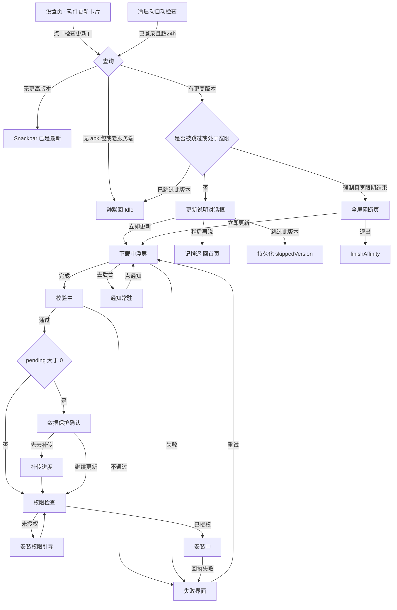
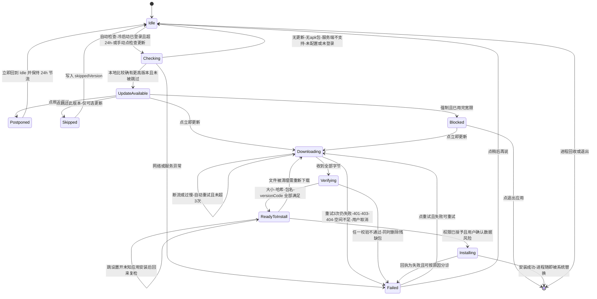

# 移动端内置在线更新功能 · 增量 PRD

> 面向仓库：`xingqiyi-laundry-photo-android`（本地 `C:\build\xqy-android-repo`）
> 配套仓库（本次仅做最小改动）：`xingqiyi-laundry-photo` 桌面端/服务端（本地 `E:\软件开发\星期衣精致洗衣衣物照片系统`）
> 文档类型：增量 PRD（不含竞品/市场分析）

---

## 一、项目信息

| 项 | 值 |
|---|---|
| Language | 中文 |
| Programming Language | Kotlin + Jetpack Compose + Material3（沿用现有栈，不引入新 UI 框架） |
| Project Name | `mobile_app_updater` |
| 当前版本 | `versionName 1.0.0` / `versionCode 10500` / `applicationId com.xingqiyi.laundryphoto`（debug 后缀 `.debug`） |
| 运行环境 | minSdk 26 / targetSdk 34 / compileSdk 34 |
| 部署场景 | **局域网门店**：手机连门店 WiFi 访问 `http://192.168.x.x:17521` 上的桌面端服务端；纯 HTTP，**无外网、无 Google Play** |

### 原始需求复述（逐条）

> 为移动端应用实现内置在线更新功能：启动时或手动触发时检查服务器上的版本信息，检测到新版本后向用户展示更新说明，并支持下载、校验（如哈希或签名校验）、安装与安装包清理。请明确：
> 1. 更新包的下载与文件存储路径策略
> 2. 下载进度与失败重试机制
> 3. 异常与弱网情况处理
> 4. 用户取消或跳过更新的处理逻辑
> 5. 更新前必要的状态保护（如数据备份、权限申请）
> 6. 代码需保持模块化，提供清晰的接口以便后续扩展
> 7. 附带必要的日志与错误提示

### 现状硬约束（已读代码/实测确认，决定了本方案的形态）

| # | 事实 | 对本功能的约束 |
|---|---|---|
| C1 | `checkUpdates()`（`main/store.js:1519`）扫描更新文件夹，正则 `(\d+\.\d+\.\d+)` 抽版本号取**最高**，**不看扩展名**；`hasUpdate` 拿桌面端自身 `appVersion` 比较 | 桌面端版本线 1.2.x 永远压过移动端 1.0.x，移动端拿到的 `latestFile` 大概率是 `.exe`；且该接口**只返回这一个文件**，客户端连「有哪些 apk」都看不到 → **纯客户端过滤在技术上不成立**（见决策 D1） |
| C2 | `getForceUpdate()`（`main/store.js:1579`）返回 `files`，而 `listUpdateFiles()` 只过滤 `/\.(exe\|zip\|msi)$/i` | 管理员在系统设置里**选不到 `.apk`**；`fileExists` 对 apk 也永远为 false |
| C3 | `GET /update-file?f=<fileName>&token=<连接码>`（`main/server.js:218`）已存在；`resolveUpdateFile()`（`main/store.js:1857`）**不限制扩展名**，已能流式下发 `.apk`，带 `Content-Length`，不支持 Range（恒返回 200 全量） | 下载通道不需要新建端点；但**断线只能整体重下**（见 U-20/P1 才优化） |
| C4 | 移动端 DTO 与服务端实际返回对不上（`UpdateInfoDto` 期望 `url/notes`，实际只有 `latestFile`；`ForceUpdateDto` 缺 `fileExists/files`） | 必须重写。且 **`CapabilitiesDto` 注释已写明血泪教训：Gson 不走 Kotlin 主构造函数、不执行默认值、缺字段一律 null** → 新 DTO 字段必须可空 + 兜底计算属性 |
| C5 | `ApiClient`（`data/remote/ApiClient.kt`）内部持有 OkHttp（connect 8s / read 60s / write 60s + `AuthInterceptor`），**未对外暴露 OkHttpClient** | 下载大文件需要新增出口（独立 OkHttp 实例或导出已有实例） |
| C6 | `OfflineRepository` 把离线照片存在 `filesDir/offline/pending`；注释明确「**补传成功后权威副本在服务端**」 | 更新流程的数据保护必须围绕「补传」而非「本地拷贝」（见 D7） |
| C7 | `Manifest` 已声明 `INTERNET / ACCESS_NETWORK_STATE / POST_NOTIFICATIONS / FOREGROUND_SERVICE*`；**未声明 `REQUEST_INSTALL_PACKAGES`**；`file_paths.xml` 只开放 `cache-path share/` | 需补充安装权限与一条受限的更新目录白名单 |
| C8 | `ProguardKeepRuleTest` 断言 `-keep class com.xingqiyi.laundryphoto.data.model.** { *; }` 等规则存在 | 新 DTO **建议放 `data.model`**，否则必须同步改该测试的 `dtoPackages` 列表（见 §5 工程约定） |
| C9 | `MainActivity` 已有 `LaunchedEffect(currentUser) { forceUpdate() → Notifier.notifyForceUpdate(...) }`，文案是「请联系管理员获取安装包后重新安装」 | 这段旧行为将被本需求取代（改为统一走更新编排器），详见 U-04 |
| C10 | 单测必须在**纯英文路径**执行 | 当前仓库 `C:\build\xqy-android-repo` 满足；新增单测落 `app/src/test/...` 即可 |

---

## 二、产品目标（可衡量）

| # | 目标 | 衡量口径 |
|---|---|---|
| G1 | **更新自助化**：店员不用找电脑、不用数据线，在手机上完成「发现→下载→安装」全流程 | 全流程最多 3 次点击（更新 → 看说明 → 更新）；除「允许安装未知应用」外无需跳到别的 App |
| G2 | **跨端互不干扰**：桌面端与移动端版本线各自演进，一端有更新不会污染另一端 | 更新文件夹里同时存在 `xxx-1.2.4.exe` 与 `xxx-android-1.1.0.apk` 时，移动端**必然**拿到 `.apk`；桌面端行为完全不变（回归用例覆盖） |
| G3 | **离线照片零丢失**：存在未上传照片时更新，数据 100% 保留或被明确告知风险 | 覆盖安装后 Room 队列与 `pending/` 照片数不变；`pending>0` 时**必须**出现二次确认；任何涉及卸载的路径必须有强提醒 |
| G4 | **弱网可用**：门店 WiFi 抖动时下载不会卡死、不会留下半截废APK | 断流 20s / 低速 15s 自动判失败；自动重试 3 次指数退避；失败后「重试」可用；`.part` 不留残余（冷启动清理） |
| G5 | **可维护**：下载/校验/安装/策略各自可替换、可单测 | 4 个核心能力全部接口化；纯逻辑（版本比较、计划合并、DTO 兼容、文件名安全）有单测且不依赖 Android |

---

## 三、关键决策与取舍

### D1. 移动端如何拿到「属于自己的」更新包 → **服务端新增专用接口，客户端同时做防御**

**结论：两条腿走路，缺一不可。**
- **必须**在服务端新增 `POST api/system/checkMobileUpdate`：只扫 `.apk`，返回 `fileName / version / size / sha256 / notes`，并按**客户端上报的版本**算 `hasUpdate`。
- **同时**，客户端保留对老接口 `system/checkUpdate` 的降级能力（新接口不存在时静默调用），并按扩展名与本地版本比较自行过滤。

**为什么不能「只做客户端过滤」**（这是本方案最关键的一条论证）：
`checkUpdates()` 只返回**一个** `latestFile`——版本号最高的那个。当文件夹里既有桌面端 `.exe`（1.2.x）又有移动端 `.apk`（1.0.x）时，返回的一定是 `.exe`。客户端拿到的响应里**没有任何其它文件的线索**，连「存在一个 apk」都不知道，遑论过滤。所谓「客户端过滤」在这种响应结构下等价于「永远没有移动端更新」。

为什么不是「反过来：桌面端自己加前缀约定」，我另外权衡过两点：
- 让文件名约定（如必须含 `-android-`）由客户端解析——仍然建立在同一个错误响应结构上，且把约定散落在两个仓库。
- 移动端直接拉一个「文件清单」接口——`forceUpdate.files` 形态上很接近，但它是**管理员视角的配置查询**，语义写着「要强推哪个文件」，且过滤规则仍是 `.exe/.zip/.msi`；把「版本发现」架在「强制推送配置」上，会让「没有强推」与「没有更新」变得无法区分。

另外两条也被否掉的选项：
- **只用 `forceUpdate` 的客户端判断**：管理员在系统设置里根本选不到 `.apk`（`listUpdateFiles` 过滤所致），等于要求所有门店都先改服务端 UI。
- **让客户端猜文件名**（拼 `…-android-<version>.apk` 去逐个试探）：会给服务端制造大量 404 与竞态，任何一次文件名改款就全线失效。

综上：新增接口是**最小且唯一正确**的修法；客户端保留降级是为了「老服务端（未升级桌面端）不打扰店员」，而不是为了绕开服务端改动。

### D2. 更新说明 notes 从哪来 → **服务端读同名旁挂文件，三级降级**

优先级：
1. **`<apk 文件名去扩展名>.md`**（整个文件内容作为说明）——优先，因为管理员不需要学 JSON；
2. **`<apk 文件名去扩展名>.json`** 的 `notes` 字段（给未来预留结构化字段）；
3. 都没有 → `notes = ""`，客户端显示兜底文案 `U-COPY-06`（明确写「管理员没有填写本次更新说明」，**不编造内容**）。

**为什么不选**：GitHub Release 说明（门店无外网，拿不到）；服务端新增带输入框的设置项（要改 `renderer.js` 的 UI 与 `store.setForceUpdate` 的完整链路，成本远高于放一个 `.md`；列为 P2）。

约束：服务端读取上限 200KB、截断 2000 字符返回；旁挂文件名取 apk 文件名的 basename，禁止拼接路径。

### D3. 哈希校验值从哪来 → **服务端为主、旁挂 `.sha256` 为辅、「没有就不校验」为铁律**

| 来源 | 处理方式 |
|---|---|
| 服务端扫描时流式计算 `sha256`（按 `文件名\|size\|mtimeMs` 缓存，最多 8 条） | 首选 |
| 同名 `.sha256` 旁挂文件（取首段十六进制） | 老服务端/管理员手工部署时可用 |
| 都没有 | **降级为不校验哈希，绝不阻断更新** |

**哈希不是唯一防线**，以下三项是无论如何都要做的强制校验（U-09）：
- 文件大小与服务端返回的 `size` 一致（不一致即判定为损坏）；
- `PackageManager.getPackageArchiveInfo()` 读出包名必须等于 `BuildConfig.APPLICATION_ID`——防止把别的应用/山寨包装进来；
- APK 的 `versionCode` 必须 **严格大于** 本机已安装版本——因为服务端是按**文件名**里的字符串挑最高版本，与 APK 内部 `versionCode` 可能不一致；这一条同时避免了 `INSTALL_FAILED_VERSION_DOWNGRADE` 的死循环。

**签名校验（optional）**：同包名 + 已安装 → Android 安装器本身就会校验证书一致性，不一致会拒绝安装（`STATUS_FAILURE_CONFLICT`），所以这一部分由系统兜底；额外比对发布证书指纹列为 P1（U-24），需要 `BuildConfig` 注入指纹，默认关闭。

### D4. 强制更新 vs 可选更新 → **合并成一条更新流程，用「版本取高、mandatory 跟随、宽限期渐进」三规则**

- **合并请求**：一次检查周期里同时取 `checkMobileUpdate`（可选轨）与 `forceUpdate`（强制轨），合成一个「更新计划」，避免两次请求、两个弹窗打架。
- **版本取高**：目标版本 = `max(可选轨最新版, 强制轨版本)`。理由：管理员的真实诉求是「必须更新」而非「必须更新到某一个版本」，更新到更高版本同样满足诉求（且通常更安全）。
- **强制属性**：只有当被选中的目标版本 **就是** 管理员强推的那个文件时，才是 `mandatory = true`；若强推版本比最新版还旧，则更新到最新版但**不强制**（仍可跳过）。
- **强制更新可以推迟，但有边界**：默认宽限 **24 小时 且 最多推迟 3 次**（二者先到者为准）；宽限期内每次冷启动弹一次可关闭的对话框；**宽限期结束后进入全屏阻断页**，只有「立即更新」和「退出」两个出口。
  - 为什么不完全禁止推迟：门店正在接待客人时硬拦会让店员砸手机，反馈一定是「这软件没法用」。
  - 为什么不完全不拦：那强制推送就形同虚设，管理员会失去对版本基线的控制。
- **强制覆盖跳过**：被标记为强制的版本永远不写入 `skippedVersion`，且若用户之前跳过过这个版本，强制属性会撤销那次跳过。
- **强制轨防御**：仅当 `forceUpdate.fileName` 以 `.apk`（忽略大小写）**结尾**时，移动端才认为强制轨有效；管理员误推 `.exe` 时移动端**静默忽略**（而不是弹一个装不了的更新）；`fileExists=false` 时降级为「按最新 apk 走可选更新」。

### D5. 「稍后再说」与「跳过此版本」的区别与持久化

| 行为 | 语义 | 持久化 | 何时再打扰 |
|---|---|---|---|
| **稍后再说**（可选更新） | 现在不方便，稍后提醒 | **完全不落盘**，仅内存中关闭当前浮层 | 下一次冷启动且距上次检查超过 24h |
| **跳过此版本**（可选更新） | 这个版本我不要 | DataStore 写 `skippedVersion = <精确版本串>` | 服务端出现**更高**版本时才再提示；同 release 版本永不再扰 |
| **稍后**（强制更新） | 正在忙 | DataStore 累加 `postponeCount`（key 含强推版本号，版本变化自动清零）+ `firstPromptAtMs` | 每次冷启动提醒，直到超限转阻断 |

- `skippedVersion` 在服务端版本号变化时自动失效（不必清理）；
- **设置页手动检查永远绕过节流与跳过**（手动就是想知道真相），命中已跳过版本时明确显示 `U-COPY-33`（告诉用户「你之前跳过过它，所以一直没提醒」）。

### D6. 启动检查的时机与频率 → **冷启动、已登录、24h 节流、不在拍照途中打扰**

触发条件（全部满足才自动检查）：
1. 已配置服务器地址且连接码非空；
2. 已完成冷启动会话校验（**登录成功后**，不在登录页检查）；
3. 距上次自动检查 > **24 小时**（节流时间戳按服务器主机分别记录，换服务器不互相干扰）；
4. 当前不在拍照/扫码/连拍页——若命中则**延后**到回到首页再触发（避免更新弹窗打断拍摄）；
5. 当前没有正在进行的下载/安装（有则不再发起新的检查）。

- 自动检查结果若「无更新 / 无移动端包 / 接口不支持」，一律**静默**，不弹任何东西；
- 手动检查（设置页）不受节流限制，但加 10 秒防连点；所有结果都给可见反馈（含「已是最新」）；
- **不做**前后台切换检查、不做定时后台轮询——局域网门店场景没有必要，且增加服务端负担。

### D7. 离线未上传照片 → **不阻断，但必须显式告知 + 给行动路径；「备份」的真身是补传**

先纠正一个常见误解：**同包名、更高版本号的覆盖安装不会清除应用数据**（Room 库、DataStore、`filesDir` 下的 `pending/` 照片全部保留，这是 Android 的安装语义，卸载才会清）。真正会让数据消失的只有两种：**用户手动卸载重装**、**换了签名导致系统要求先卸载**。

因此策略是「警告 + 行动」，而不是「阻断」：

1. `pendingCount > 0` 时，安装前的确认页额外展示未上传张数，并提供两个按钮：`U-COPY-13`「先去补传」→ 触发 `SyncManager.enqueueImmediate()` 并显示 `x/y` 进度，补传完再回到界面；`U-COPY-14`「备份到相册」(P1) → 复用 `BurstPhotoStore.writeToGallery()`（已处理 Android 10+ `RELATIVE_PATH` 与 9- 的 `insertImage` 两条分支）把照片复制到 `Pictures/星期衣离线照片/`，这是唯一能扛住「卸载重装」的副本。
2. 允许直接继续更新，但必须有一句人话：`U-COPY-12`「同款软件直接更新，照片不会丢；**请不要先卸载再安装**」。
3. 安装被系统以「签名不一致（`STATUS_FAILURE_CONFLICT`）」拒绝时，文案必须警告卸载会丢照片并引导先备份（见 U-10 分诊表）。
4. **不做**「更新前自动导出配置备份」：覆盖安装不丢 DataStore，收益为零；也不做「整份数据导出到 SD 卡」这种看似稳妥的方案——它要新增存储权限、会把客人衣物照片散落到公共目录，是隐私与权限的新泥潭（这也是 `OfflineRepository` 当初刻意把照片放在 app 私有目录的原因）。

### D8. 权限申请 → **`REQUEST_INSTALL_PACKAGES` 三段式引导（必做）+ 通知权限（软引导）**

- **必需**：`REQUEST_INSTALL_PACKAGES`。Android 8.0+ 起，未知来源安装权限是**按 App 授予**的，必须由用户到系统设置里开。采用与 `CameraPermissionGate` 完全一致的三段式：
  1. 说明用途 → 请求（跳 `ACTION_MANAGE_UNKNOWN_APP_SOURCES`，URI `package:<自身包名>`）；
  2. 用户返回后自动复检；仍未开启 → 显示第二步说明；
  3. 用户勾选「不再询问」或多次拒绝 → 显示「去设置手动开启 + 我已开启，重新检查」的兜底按钮。
  文案必须说明「这是安装我们自家 App 更新用的，不会让你装别的东西」（`U-COPY-08`）。
- **软性**：`POST_NOTIFICATIONS`（Manifest 已声明，需运行时申请）。用于下载进度通知；**被拒绝不阻断**，只是没有通知，进度仍可在应用内看到。
- **一律不申请**：任何存储权限。APK 落在应用私有目录，经 FileProvider `content://` 授权给安装器，Android 10+ 写相册走 MediaStore，均不需要存储权限。

### D9. 服务端改动范围 → **只加 1 个接口 + 1 处正则 + 1 个能力标记，全部向后兼容**

详见 §9。**原则：不改动任何现有接口的返回结构**（`checkUpdates` / `forceUpdate` / `/update-file` 的字段只增不减不改语义），确保只升移动端、不升桌面端的门店仍能正常营业（移动端降级，桌面端零感知）。

### D10. 下载不装在 WorkManager 上

`WorkManager` 在本项目里只负责「离线照片补传」（见 `SyncManager`），而更新是**用户当面盯着**的短任务（局域网 20MB APK 约 10~60 秒），需要逐字节进度、即时取消、即时重试。决定：**由 `AppContainer` 持有的 `UpdateCoordinator`（应用级 `CoroutineScope`）承担**，UI 通过 `StateFlow` 观察。这样旋转/跳转/退出设置页都不会中断下载；进程被杀则落到 `Failed` 并给出可重试的文案（符合「做到一半被系统回收」的现实）。下载期间同时发进度通知，让用户切出去也看得见。是否需要前台 Service 保活列为 P1。

### D11. 弱网与异常的分级处理

| 异常 | 自动重试 | 用户看到 |
|---|---|---|
| 连接超时 / 读超时 / 连接被重置 / UnknownHost | 是（3 次，退避 2s→6s→15s） | 重试中显示 `U-COPY-17`；三次后 `U-COPY-18` |
| 下载中断流（**连续 20s 未收到任何字节**） | 是（计入重试） | 同上 |
| 下载过慢（连续 15s 平均 **< 20KB/s**） | 是（计入重试） | `U-COPY-19` |
| HTTP 401 / 403 | **否** | `U-COPY-20`（连接码失效，引导去设置页重配） |
| HTTP 404 | **否** | `U-COPY-21`（服务器上的安装包不见了，联系管理员） |
| HTTP 5xx | 是（1 次） | 三次后 `U-COPY-18` |
| 磁盘空间不足 | 否 | `U-COPY-22`（带「清理更新缓存」按钮） |
| 校验失败（size/sha256/包名/versionCode） | 否（删除残缺文件后回到可用） | `U-COPY-23/24/25` 按原因分诊 |
| 接口不存在（老服务端） | 否 | 静默（绝不弹错误） |

---

## 四、用户故事

| # | 角色 | 故事 |
|---|---|---|
| S1 | 门店店员 | 作为**门店店员**，我希望**打开 App 时它能自己发现新版并弹窗告诉我**，以便**我不用去找电脑、不用数据线也能更新** |
| S2 | 门店店员 | 作为**正在接待客人的店员**，我希望**在忙的时候可以点「稍后再说」先去干活**，以便**更新不打断我手上这一单** |
| S3 | 门店店员 | 作为**手机里还有几十张离线照片没上传的店员**，我希望**更新前系统明确告诉我照片会不会丢、没传完能不能先传**，以便**我不会因为更新而丢掉客人的衣物凭证** |
| S4 | 门店店员 | 作为**连着不太稳定的店内 WiFi 的店员**，我希望**下载卡住时 App 自己重试、失败时告诉我为什么并且能一键重来**，以便**我不懂技术也能把更新完成** |
| S5 | 门店店员 | 作为**普通店员**，我希望**能一眼分清「可以更新的新版本」和「管理员要求必须更新」**，以便**我知道这次能不能拒绝** |
| S6 | 门店店员 | 作为**不想折腾的店员**，我希望**允许安装未知应用这一步有清楚的中文说明和去设置的按钮**，以便**我不会卡在系统设置里出不来** |
| S7 | 门店管理员 | 作为**门店管理员**，我希望**只要把 APK 拷进「软件更新」文件夹、旁边放一个同名 .md 写说明**，以便**手机端就能看到新版本和更新说明** |
| S8 | 门店管理员 | 作为**门店管理员**，我希望**在系统设置里勾选某个 APK 开启强制推送后，手机端最终一定会更新**，以便**我能把版本基线收口，而不用一台台手机去劝** |
| S9 | 维护工程师 | 作为**后续维护这个仓库的工程师**，我希望**下载/校验/安装/策略都通过接口注入**，以便**我可以单独替换某一环并为它写单测** |

---

## 五、需求池（P0 / P1 / P2）

> 验收标准必须可被手工回归验证（门店现场可执行）。

### P0（必须实现）

| 编号 | 需求描述 | 验收标准 |
|---|---|---|
| **U-01** | **服务端**新增 `api/system/checkMobileUpdate`：只扫 `.apk`、返回 `fileName/version/size/sha256/notes/notesSource/hasPackage/hasUpdate`；`hasUpdate` 按请求体中的 `currentVersion` 比较 | ① 更新文件夹同时含 `xxx-1.2.4.exe` 与 `xxx-android-1.1.0.apk` 时，返回的一定是 `.apk`；② 文件夹无 apk 时返回 `hasPackage=false` 且 **HTTP 200 + ok=true**（不是报错）；③ 现有 `checkUpdates` 返回值逐字段不变；④ sha256 结果与 `sha256sum` 一致 |
| **U-02** | 移动端重写 DTO：新增 `MobileUpdateInfoDto`；`ForceUpdateDto` 补 `fileExists / files`；`UpdateInfoDto` 补 `latestFile`。**所有字段可空 + 兜底计算属性** | ① 用「只含老字段」的 JSON 反序列化，读任一属性都不抛 NPE（单测）；② 单测断言字段名与 §9 契约一致；③ 新 DTO 放在 `data.model` 包，`ProguardKeepRuleTest` 仍然绿 |
| **U-03** | 更新发现编排：新接口优先 → `ApiError.Unsupported`（「接口不存在」）时降级老接口 → 老接口结果必须满足「扩展名 `.apk` 且本地比较版本更高」才可用 | ① 新接口可用时不产生任何失败请求；② 老服务端返回 `.exe` 时**不弹窗、不报错**、状态回 `Idle`；③ 服务端 `hasUpdate` 仅作提示，**是否更新永远以客户端本地版本比较为准** |
| **U-04** | 强制更新与可选更新合并为单一计划（规则见 D4），替换 `MainActivity` 中旧的 `forceUpdate → Notifier.notifyForceUpdate` 逻辑 | ① 强推 `.exe` 时移动端完全无感；② 强推版本 < 最新 apk 版本时：更新到最新版且**不强制**；③ 强推版本 == 目标版本时：对话框无「跳过此版本」，且吞掉该版本的 `skippedVersion` |
| **U-05** | 启动检查节流与前置条件（D6） | ① 24h 内只自动查一次；② 未配置服务器 / 未登录时不发检查请求；③ 在连拍页时不弹任何更新 UI，回首页后再弹；④ 设置页手动检查不受节流限制 |
| **U-06** | APK 下载：独立 OkHttp 出口（携带连接码，走**请求头**而非 URL 查询参数）→ 写 `<target>.part` → `rename` 原子替换 → 目标 `filesDir/updates/<fileName>` | ① 下载过程中强杀 App，重启后无半截 `.apk`（只有 `.part` 并被清理）；② 中断后重下能覆盖同名文件；③ 抓包确认连接码不出现在 URL 里 |
| **U-07** | 下载进度：UI（百分比 + 已下载/总量 + 速度）+ 通知（复用现有 `Notifier` 风格，新增 `xqy_update` 渠道）；回调节流 **400ms 或百分比变化 ≥1%**（与桌面端 `update-download.js` 的 400ms 节流保持一致） | ① 21MB APK 下载时 UI 与通知同步更新，无卡顿；② 通知点击可回到下载界面；③ 百分比单调不回退 |
| **U-08** | 失败重试：自动 3 次指数退避（2s/6s/15s）+ 断流 20s + 低速 15s 判定；手动「重试」按钮 | ① 拔网线 10s 后恢复，下载最终成功且用户无需操作；② 三次失败后显示失败界面，手动重试可用；③ 重试次数计数上限受控，不会出现无限重下刷爆服务端（对齐 `update-download.js` 的多通道降级思路但单通道即可） |
| **U-09** | 安装包校验：`size` → `sha256`（有才校）→ 包名必须等于 `BuildConfig.APPLICATION_ID` → `versionCode` 必须严格大于已安装值 | ① 篡改 1 字节后安装被拦并提示 `U-COPY-23`；② 服务端没给 sha256 时**照常继续安装**（不阻断）；③ 放一个更低 versionCode 的 APK 上去，被拦且提示 `U-COPY-25`；④ 放包名不同的 APK，被拦且提示 `U-COPY-24` |
| **U-10** | 安装：主路径 `PackageInstaller.Session` + 动态注册的回执 Receiver（`RECEIVER_NOT_EXPORTED`）；Session 打开/写入异常时降级 `ACTION_VIEW` + FileProvider content URI（需给安装器 `FLAG_GRANT_READ_URI_PERMISSION`） | ① 成功安装后 UI 显示完成提示；② 失败能按状态分诊（见 U-10 分诊表）；③ Android 8 / 11 / 14 三台真机各完成一次成功更新；④ `file_paths.xml` 只新增受限的 `updates/` 条目，不开放整个私有目录 |
| **U-11** | 「允许安装未知应用」三段式引导（D8） | ① 首次安装必定引导且能跳到正确的系统设置页；② 关闭后回到 App 自动复检并继续安装；③ 用户拒绝到底时有「去设置 + 我已开启，重新检查」兜底，不出现死路 |
| **U-12** | 「稍后再说」/「跳过此版本」的持久化语义（D5） | ① 跳过 1.1.0 后，服务端仍是 1.1.0 时冷启动**不再弹**；② 服务端换成 1.2.0 时重新弹出；③ 手动检查能显示「你之前跳过了此版本」；④ 强制版本不受跳过影响 |
| **U-13** | 离线照片保护（D7）：`pending>0` 时安装前的告知 + 「先去补传」+ 明确「请勿卸载重装」 | ① pending=37 时确认页显示 37；② 点「先去补传」能在更新流程里等到 `37/37`；③ 覆盖安装后照片数与 Room 队列完全一致（真机验证）；④ **任何**提示卸载的路径都带丢数据警告 |
| **U-14** | 安装包清理：下载前清 `.part`；冷启动异步清理「7 天前的文件 + 所有 `.part`」；安装会话提交后 **30 分钟内**保护该文件不被清理；设置页提供「清理更新缓存」入口 | ① 连续下载两次后目录里只有 1 个 apk；② 手工往目录里丢几个临时文件，冷启动后全部被清干净；③ 安装完成后 30 分钟内不会被清理脚本删掉正在用的文件 |
| **U-15** | 日志：Logcat tag `XqyUpdate`；关键节点（检查/发现/重试/校验结果/安装回执）写入 `filesDir/updates/update.log`，滚动保留最近 200 条；失败界面提供「复制错误信息」 | ① 一次完整更新流程日志 ≥10 条、含耗时与字节数；② 失败界面复制出来的文本包含错误类型、HTTP 状态（若有）与日志末尾 20 行；③ 日志中不出现连接码、会话令牌（脱敏） |
| **U-16** | 设置页入口：新增「软件更新」卡片（当前版本 + 上次检查时间 + 有更新时红点），点击「检查更新」；右上角新增「更新进行中」指示（可选） | ① 入口可见且角色无关（所有登录用户都能自查）；② 「已是最新」「无可用手机包」都有对应提示；③ 检查中按钮禁用防连点 |
| **U-17** | 磁盘预检：下载前用 `StatFs` 校验可用空间 ≥ `size * 1.5`（且至少额外 20MB 余量） | ① 空间不足时**不下第一个字节**并提示 `U-COPY-22`；② 提示带「清理更新缓存」按钮 |
| **U-18** | 模块化接口（§6）：`UpdateSource / UpdateDownloader / UpdateVerifier / UpdateInstaller / UpdatePolicyStore / UpdateCoordinator` 六个角色，实现可注入替换 | ① 新增/替换任一实现不需改动 UI 层；② 至少 4 个纯逻辑单测可在无 Android 依赖下运行 |

**U-10 失败分诊表**

| 安装结果 | 用户看到 |
|---|---|
| `STATUS_SUCCESS` | `U-COPY-15` |
| `STATUS_FAILURE_BLOCKED` | `U-COPY-09`（多半是不允许安装未知应用） |
| `STATUS_FAILURE_CONFLICT` | `U-COPY-26`（签名/包名冲突→**卸载会丢照片**，先备份） |
| `STATUS_FAILURE_INCOMPATIBLE` | `U-COPY-27`（系统版本或硬件不支持） |
| `STATUS_FAILURE_INVALID` | `U-COPY-25`（包损坏或版本更旧） |
| `STATUS_FAILURE_STORAGE` | `U-COPY-22` |
| 回执丢失（进程被杀） | 兜底判定：冷启动比对已安装 `versionCode`，变了即认为成功，否则回到「可重试」 |

### P1（应该有）

| 编号 | 需求描述 | 验收标准 |
|---|---|---|
| **U-19** | 「备份到相册」：把未上传照片用 `BurstPhotoStore.writeToGallery` 复制到 `Pictures/星期衣离线照片/<日期>/` | Android 10+ 与 Android 8/9 两条机型各验证一次，系统相册可见且删除 App 后照片仍在 |
| **U-20** | 断点续传：服务端 `/update-file` 支持 `Range` 后，客户端用 If-Range/206 续传 | 下载到 60% 断网后恢复，起点不是 0（抓包确认 206） |
| **U-21** | `capabilities.features` 增加 `mobileUpdate: true`（使移动端免发一次注定失败的探测请求）；**不升 `apiVersion`**（避免影响其它客户端的兼容判断） | 老服务端（`features` 无该键）不会误判；缺失时仍直接调用新接口 |
| **U-22** | 下载前台 Service 保活（`FOREGROUND_SERVICE_DATA_SYNC` 已在 Manifest） | 下载中熄屏 5 分钟，回来进度继续且未完成 100% |
| **U-23** | 通知权限软申请引导（首次进入下载前） | 拒绝后仍可在 App 内看进度，功能不受阻 |
| **U-24** | 发布证书指纹校验（`BuildConfig` 注入 SHA-256，空值即跳过） | 用不同签名打的 APK 被拦下；未配置的 debug 包照常工作 |
| **U-25** | 预计剩余时间展示（速度稳定 3s 后才显示） | 波动剧烈时不显示，避免「还剩 1 秒」然后 3 分钟 |
| **U-26** | 桌面端「更新说明」编辑 UI（写 `.md` 旁挂文件），免去手工建文件 | 管理员在系统设置写完说明，手机端立即能读到（含缓存失效） |

### P2（锦上添花）

| 编号 | 需求描述 | 验收标准 |
|---|---|---|
| **U-27** | 按 ABI/屏幕密度挑选最合适的 APK（服务端返回候选清单） | arm64 设备拿到 arm64 包 |
| **U-28** | 更新失败上报服务端操作日志（需新接口） | 管理员能在日志页看到「某某手机更新失败及原因」 |
| **U-29** | 管理者可设置「维护时段」（如 22:00 后才提醒更新） | 营业时间不再打扰 |
| **U-30** | 差分包（bsdiff/patch）以节省流量 | 增量包体积 < 全量包 30% |

### 工程约定（同属于 Deliverable 的一部分）

1. **包位置**：新 DTO 一律放 `com.xingqiyi.laundryphoto.data.model`（自动被 `-keep` 覆盖）；若确要新建 `…update.model` 包，必须同步把包名加进 `ProguardKeepRuleTest.dtoPackages`，否则 release 包会复刻「莫名说对方返回的不是本系统数据」那次事故。
2. **注释风格**：每个新类都要写详细中文 KDoc，讲清「为什么这么做」和踩过的坑，对齐 `SystemRepository / ApiClient / SettingsStore / BaseViewModel` 的风格。
3. **不要触碰**：现有 `ApiEnvelope` 解析链路、`AuthInterceptor`、`checkUpdates()` / `getForceUpdate()` 的既有字段语义。
4. **单测路径**：新增单测必须在**纯英文路径**运行（当前仓库符合）。建议最少四条：`VersionComparatorTest`、`MobileUpdateInfoDtoCompatTest`（老服务端 JSON 不全 → 不 NPE）、`UpdatePlanResolverTest`（强制/可选合并规则）、`UpdateFileNameSafetyTest`（禁 `..` 与分隔符）。

---

## 六、模块化接口边界（对应原始需求第 6 条）

| 角色 | 契约要点 | 默认实现 | 为何要独立 |
|---|---|---|---|
| `UpdateSource` | `suspend fun discover(current: SelfVersion): DiscoveredUpdate`（内部封装「新接口→老接口」降级） | `ServerUpdateSource(api)` | 将来换成 HTTPS CDN / 第三方分发只换这个类 |
| `UpdateDownloader` | `suspend fun download(spec, dest, progressCb): DownloadOutcome` | `OkHttpUpdateDownloader(okHttp, baseUrl, token)` | 便于用 MockWebServer 测断点/退避逻辑 |
| `UpdateVerifier` | `suspend fun verify(file, spec): VerifyResult`（reason 可枚举） | `DefaultUpdateVerifier(context)` | 校验规则变化不影响下载与安装 |
| `UpdateInstaller` | `fun install(file): InstallHandle` + 结果回执 | `SessionPackageInstaller`（降级 `IntentInstaller`） | 系统 API 变动/ROM 差异只隔离在这里 |
| `UpdatePolicyStore` | 节流时间戳 / `skippedVersion` / 强制推迟计数 的读写 | `DataStoreUpdatePolicyStore` | 策略是产品决策，最容易改，必须单点 |
| `UpdateCoordinator` | 持有上述角色，输出 `StateFlow<UpdateState>`；`check(auto)/start()/cancel()/skipVersion()/postpone()` | 单例，挂 `AppContainer` | UI 只认状态，不认流程 |

依赖方向严格单向：`ui/update` → `UpdateCoordinator` → 接口 → 实现。**不允许** UI 直接持有 OkHttp 或 `PackageInstaller`。

---

## 七、UI 设计稿描述（Compose / Material3）

> 所有更新 UI 挂在 `AppRoot` 之上的**全屏浮层**（`UpdateOverlay`），不侵入现有 NavHost 路由的好处：从任何页面、从通知点击回来都能展示，且不打断拍照/连拍页（那些页面由 U-05 的「延后」规则保护）。

### 7.1 页面/浮层清单与元素

**① 设置页 · 软件更新卡片（新增）**
- 卡片：标题「软件更新」；`InfoRow` 显示「当前版本 v1.0.0」；辅助行「上次检查：今天 09:12」（未检查过显示「尚未检查」）；有可用更新时右侧显示红色圆点 + 「有新版本 v1.1.0」。
- 主按钮 `PrimaryButton`「检查更新」；检查中按钮禁用并显示环形进度（`busy` 复用 `BaseViewModel` 语义）。
- 次要入口 `TextButton`「清理更新缓存」（见 U-14），带二次确认。

**② 可选更新对话框**（`AlertDialog`，Material3，圆角 28dp）
- 图标：`system_update` 矢量图标，主色。
- 标题：`U-COPY-01`「发现新版本 v1.1.0」。
- 元信息行（三列，`bodySmall`）：`安装包 21.4 MB` · `来自 192.168.1.10` · `当前 v1.0.0`。
- 更新说明：高度上限 200dp 的**可滚动**卡片，等宽小字号展示服务端 `notes`；无说明时显示 `U-COPY-06`（次要色）。
- 提示行：`U-COPY-11`「更新过程中 App 会关闭一次，你的离线照片不会丢失」。
- 按钮（纵向排列，`PrimaryButton` 优先）：「立即更新」/「稍后再说」/「跳过此版本」（`OutlinedButton`，次要色）。
- 不可用外部点击关闭（`onDismissRequest` 空实现）——防止店员随手在空白处一点就永久错过了。

**③ 强制更新对话框**（同 ② 布局，差异如下）
- 顶部增加一行警告条（`Danger` 色容器 + 图标）：`U-COPY-03`「管理员要求必须更新后才能继续使用」。
- 剩余推迟次数提示：`U-COPY-04`（含剩余次数或剩余时长）。
- 按钮精简为两个：「立即更新」/「稍后」（**无**「跳过此版本」）。

**④ 强制更新宽限期结束 → 全屏阻断页**
- 全屏（`fillMaxSize`，背景 `background` 色），居中卡片：大图标 + `U-COPY-03` + `U-COPY-02`（版本号/大小）+ 说明 + 底部两个按钮「立即更新」（`PrimaryButton`）与「退出应用」（`OutlinedButton`，`Danger`）。
- **无返回键退出**、无手势关闭；`BackHandler` 拦截并提示 `U-COPY-10`。
- 右上角保留「复制错误信息」入口（便于现场排障）。

**⑤ 下载中界面**（全屏浮层，替换对话框）
- 顶部：标题「正在下载更新」+ 版本号 `v1.1.0`。
- 中部：`LinearProgressIndicator(progress)`，上方一行右对齐百分比（`titleLarge`），下方一行 `U-COPY-16`「已下载 8.2 MB / 21.4 MB · 320 KB/s」（`bodySmall`）。
- 提示：`U-COPY-07`「下载时请不要关闭本页面，可以到别处继续干活，进度会在通知里显示」。
- 按钮：「收到通知，去后台」（等同按返回键：收起浮层、保留下载、显示通知）与「取消下载」（二次确认 `U-COPY-28`）。
- **返回键不取消下载**，只让浮层消失（与「去后台」同效）。

**⑥ 校验中**
- 在下载界面就地切换：`CircularProgressIndicator` + `U-COPY-29`「正在检查安装包是否完整…」，不可取消。

**⑦ 安装确认（数据保护）**
- 仅当 `pendingCount > 0` 才出现：`ConfirmDialog`，标题 `U-COPY-12`，正文列出「还有 37 张照片没有上传到服务器」+ 说明「直接更新不会丢；卸载重装会丢」。
- 按钮：「先去补传」（触发 `SyncManager.enqueueImmediate` 并显示 `已上传 12/37`，完成后提示「已全部上传」并自动进入安装）/「备份到相册」(P1) /「我确认，继续更新」。
- `pendingCount == 0` 时**不再弹确认**，直接交给安装器（系统安装界面本身就是一次确认）。

**⑧ 安装权限引导（三段式）**
- 阶段一：`AlertDialog`，正文 `U-COPY-08`，按钮「去设置」「暂不」。
- 阶段二（回到 App 仍未授权）：同一浮层显示更详细的分步指引 + 「重新检查」。
- 阶段三（用户不再询问/多次拒绝）：列表式步骤 + 「打开设置」「我已开启，重新检查」。
- 结构复用 `CameraPermissionGate` 的思路，独立成 `InstallPermissionGate`。

**⑨ 安装中**
- 全屏浮层：`U-COPY-30`「正在安装，接下来由手机系统接管，安装完会自动打开新的版本」。
- 同时保留通知，避免用户以为 App 卡死。

**⑩ 失败/重试界面**
- 图标（错误色）+ 阶段标题（「下载失败」/「安装包无法安装」）+ **人话**原因（按 D11 与 U-10 分诊表文案）+ 灰色代码块（错误类型，折叠）。
- 按钮：「重试」（可重试时为主按钮）/「稍后再说」/「复制错误信息」；空间不足时把「重试」换成「清理更新缓存」。

**⑪ 结果提示（轻量）**
- 无更新：`Snackbar` `U-COPY-05`；无可用手机包：`Snackbar` `U-COPY-31`；接口不支持（老服务端，手动检查时）：`Snackbar` `U-COPY-32`。

**⑫ 通知**
- 新增渠道 `xqy_update`（名称「软件更新」，`IMPORTANCE_DEFAULT`）。
- 下载中：`setOngoing(true)` + `setOnlyAlertOnce(true)` + `setProgress`，同一 ID 反复更新（沿用 `Notifier.notifySyncProgress` 写法）。
- 下载完成：「更新包已就绪，点此安装」，`PendingIntent` 指向浮层，并给安装器授予 URI 读权限。

### 7.2 页面流转图



---

## 八、状态机定义

### 8.1 状态（`UpdateState` sealed class）

| 状态 | 含义 | UI 表现 |
|---|---|---|
| `Idle` | 未检查 / 本次无需关注 | 无 UI |
| `Checking` | 正在向服务端查询 | 设置页按钮 loading / 启动期无 UI |
| `UpdateAvailable(plan, mandatory, remainingPostpone)` | 发现可用版本，等用户决定 | ② 或 ③ |
| `Blocked(plan)` | 强制且宽限期结束 | ④ 全屏阻断 |
| `Downloading(progress)` | 下载中 | ⑤（含后台运行） |
| `Verifying` | 校验中 | ⑥ |
| `ReadyToInstall(pending)` | 校验通过，待确认/待权限 | ⑦ / ⑧ |
| `Installing` | 已交给系统安装器 | ⑨ |
| `Failed(stage, reason, retryable)` | 任一阶段失败 | ⑩ |
| `Skipped(version)` | 用户跳过该版本（转为 Idle） | 无 UI |
| `Postponed` | 稍后再说（转为 Idle） | 无 UI |

### 8.2 状态迁移图



### 8.3 迁移条件补充

- `Checking → UpdateAvailable` 的**唯一判据是客户端本地版本比较**（服务端 `hasUpdate` 只作参考），这是跨版本线（1.2.x vs 1.0.x）不串台的根本保证。
- `Downloading` 期间 App 被杀：冷启动后落到 `Failed(stage=DOWNLOAD, reason=INTERRUPTED, retryable=true)`，并在冷启动清理 `.part`。
- `Installing` 后进程被系统重启视为成功路径：冷启动比对已安装 `versionCode` 与本地记录的「更新前版本」即可判定。
- 任何 `Failed` 都不允许自动跳回 `Idle`，必须由用户点「稍后再说」或重试，避免失败被静默吞掉。

---

## 九、服务端最小改动清单（桌面端仓库 `xingqiyi-laundry-photo`）

> 目标：**文件数最少、行数最少、向后完全兼容**。移动端单独升级时，老服务端不至于刷出一堆错误。

| 文件 | 改动点 | 兼容性 |
|---|---|---|
| `main/store.js` | **新增** `checkMobileUpdate(params)`：① 扫描 `getUpdateDir()` 下**仅** `.apk`（`/\.apk$/i`）且文件名含 `\d+\.\d+\.\d+`；② 取版本最高者；③ `fs.statSync` 取 `size`；④ 流式算 sha256（`crypto.createHash`，按 `name\|size\|mtimeMs` 缓存，Map 上限 8）；⑤ 读同名旁挂 `.md`（优先）/ `.json` 的 `notes`，上限 200KB、截断 2000 字符；⑥ `hasUpdate` 用 **`params.currentVersion`** 比较（复用现成的 `compareVersions`）；返回 `{supported,hasPackage,fileName,version,size,sha256,notes,notesSource,hasUpdate,currentVersion}` | 纯新增函数，`checkUpdates()` 一行不改 |
| `main/store.js` | **改一行正则**：`listUpdateFiles()` 的 `/\.(exe\|zip\|msi)$/i` → `/\.(exe\|zip\|msi\|apk)$/i`，使管理员能选中 APK、`fileExists` 对 apk 生效 | 只放宽，现有桌面端下拉仍能列出全部原文件；**已知副作用**：桌面端下拉会多出 APK 条目（建议 U-26 时给 label 加「（安卓包）」后缀，属 P2 视觉优化） |
| `main/store.js` | `return {...}` 导出表新增 `checkMobileUpdate` | 纯新增 |
| `main/server.js` | routes 表新增一行 `'system/checkMobileUpdate': () => store.checkMobileUpdate(body)` | 放在 `system/checkUpdate` 之后；命中不到时现有逻辑已会返回「接口不存在」，正好触发移动端静默降级 |
| `main/store.js`（建议，P1） | `CAPABILITIES.features` 增加 `mobileUpdate: true` | **不要**改 `apiVersion`（会影响移动端的 `supportsMobileAddons` 判断）；`/ping` 自动带上新字段 |
| `main/server.js` | **不改动** `/update-file` | 已实测 `resolveUpdateFile()` 不限制扩展名，`.apk` 可直接下发 |

### 新接口契约

**请求** `POST /api/system/checkMobileUpdate`（与其它 `/api/*` 一致，需连接码 + 会话）

```json
{ "platform": "android", "appId": "com.xingqiyi.laundryphoto", "currentVersion": "1.0.0", "currentCode": 10500 }
```

**响应**（`ok/data` 信封，老字段语义不变）

```json
{
  "ok": true,
  "data": {
    "supported": true,
    "hasPackage": true,
    "fileName": "xingqiyi-laundry-photo-android-1.1.0.apk",
    "version": "1.1.0",
    "size": 22456789,
    "sha256": "3f9a1c0e2b7d4a5f8c1e6d9b0a7c3e5f1d8b4a2c6e0f9d3b7a1c5e8f2d6b4a09",
    "notes": "- 修复弱网下上传失败\n- 优化连拍速度",
    "notesSource": "md",
    "hasUpdate": true,
    "currentVersion": "1.0.0"
  }
}
```

无 APK 时（**不是错误，移动端据此静默**）：

```json
{ "ok": true, "data": { "supported": true, "hasPackage": false, "hasUpdate": false,
  "fileName": "", "version": "", "size": 0, "sha256": "", "notes": "", "notesSource": "" } }
```

**移动端侧的防御必须同时存在**：即使 `hasUpdate` 为 true，客户端仍要自己做一次版本比较；即使 `fileName` 非空，也要先校验扩展名是 `.apk` 才可用。

字段口径补充：
- `sha256`：64 位小写十六进制；服务端**算不出来时就返回空串**，移动端据此跳过哈希校验（**绝不因缺哈希而阻断更新**）；
- `size`：字节数；服务端取不到时为 `0`，移动端遇到 `0` 即跳过大小校验；
- `notes`：已截断到 2000 字符；为空时移动端显示 `U-COPY-06`；
- `notesSource`：`md` / `json` / `""`，仅用于日志排障，不作为是否展示的依据；
- `supported`：恒为 `true`，保留给将来「服务端明确关闭移动端更新」的场景；
- `hasPackage`：为 `false` 表示更新文件夹里根本没有 APK，是**正常情况**，不是错误。

---

## 十、文案清单（中文，面向门店店员）

> 全部落 `res/values/strings.xml`（更新相关文案统一由资源提供：通知需要 `Context.getString`，且便于门店反馈后快速改措辞）。现有 `Notifier` 里硬编码的字符串本次**不动**，避免扩大改动面。

| 编号 | 场景 | 文案 |
|---|---|---|
| U-COPY-01 | 可选更新对话框标题 | 发现新版本 v%1$s |
| U-COPY-02 | 阻断页副标题 | 需要安装 v%1$s（安装包 %2$s）后才能继续使用 |
| U-COPY-03 | 强制更新警示 | 管理员要求必须更新后才能继续使用 |
| U-COPY-04 | 强制更新剩余次数 | 你现在可以先忙，我还会再提醒你 %1$d 次。超过之后就必须更新了 |
| U-COPY-05 | 已是最新 | 已经是最新版本（v%1$s），不用更新 |
| U-COPY-06 | 无更新说明 | 管理员没有写这次的更新说明。更新不会删除你的照片 |
| U-COPY-07 | 下载中提示 | 下载时可以正常干活，进度会在手机顶部的通知里显示，网卡了会自动重试 |
| U-COPY-08 | 安装权限引导 | 手机出于安全考虑，默认不允许安装不是应用商店下载的软件。请允许「星期衣衣物照片」安装更新——这个权限只用于安装本软件的官方更新，不会安装别的东西 |
| U-COPY-09 | 权限被系统拦截 | 手机当前不允许安装更新，请先在系统设置里允许后再试 |
| U-COPY-10 | 阻断页按返回 | 这次更新必须完成才能继续，请先点「立即更新」 |
| U-COPY-11 | 更新前安抚 | 更新过程中 App 会关闭并重新打开一次，你的离线照片不会丢失 |
| U-COPY-12 | 离线照片保护标题 | 还有 %1$d 张照片没有传到服务器 |
| U-COPY-13 | 先去补传按钮 | 先传给服务器 |
| U-COPY-14 | 备份到相册按钮 | 备份到手机相册 |
| U-COPY-15 | 安装成功 | 更新完成，正在打开新版本 |
| U-COPY-16 | 进度文案 | 已下载 %1$s / %2$s · %3$s/秒 |
| U-COPY-17 | 重试中 | 网络不太稳，正在第 %1$d 次重试… |
| U-COPY-18 | 下载失败 | 更新包没能下载完成。通常是店里 WiFi 信号不好。请走到路由器附近再点重试 |
| U-COPY-19 | 下载过慢 | 网速太慢，先停下来了。换个位置靠近路由器，再点重试 |
| U-COPY-20 | 鉴权失败 | 服务器拒绝了这次下载（连接码不对）。请到「设置」重新配置服务器连接码 |
| U-COPY-21 | 文件不存在 | 服务器上找不到这个更新包了（可能已被清理）。请联系店里的管理员重新放一份 |
| U-COPY-22 | 空间不足 | 手机存储空间不够放这个更新包（还需要 %1$s）。请先删掉一些照片或视频，或点「清理更新缓存」 |
| U-COPY-23 | 校验失败-哈希 | 下载到的文件不完整（校验没通过），我已经删掉了，请重新下载 |
| U-COPY-24 | 校验失败-包名 | 这个安装包不是「星期衣衣物照片」，已停止安装。请联系管理员确认放到服务器上的文件是否正确 |
| U-COPY-25 | 校验失败-版本更低 | 这个安装包并不比现在用的新，已停止安装。请联系管理员换成新版本的安装包 |
| U-COPY-26 | 安装冲突（需卸载） | 手机不让直接覆盖安装（安装包签名和现在用的不一样）。**如果要卸载后重装，请先备份离线照片，否则那些照片会丢失** |
| U-COPY-27 | 不兼容 | 这个版本的手机装不了这个更新包，请联系管理员 |
| U-COPY-28 | 取消确认 | 要取消这次下载吗？已经下载的部分会被删掉，下次需要重新下载 |
| U-COPY-29 | 校验中 | 正在检查安装包是否完整，请不要关闭页面 |
| U-COPY-30 | 安装中 | 正在安装，接下来交给手机系统完成，装好后会自动打开新版本 |
| U-COPY-31 | 无可用包 | 这台服务器还没有提供手机版的安装包，请让管理员把 APK 放进「软件更新」文件夹 |
| U-COPY-32 | 服务端不支持 | 这台服务器的桌面端版本较旧，不支持手机自查更新。请让管理员升级桌面端，或手动安装新版本 |
| U-COPY-33 | 跳过提示（手动检查时） | 你之前跳过过 v%1$s，所以我一直没有提醒。现在仍可以更新它 |
| U-COPY-34 | 复制错误（Toast） | 错误信息已复制，发给技术同事即可 |
| U-COPY-35 | 清理缓存完成 | 已清理 %1$s 的更新缓存 |

（通知标题/副文案：`软件更新`；下载中：`正在下载 v1.1.0  38%`；就绪：`v1.1.0 已下载完成，点此安装`。）

---

## 十一、待确认问题与默认取舍

| # | 问题 | 默认取舍 | 若要多问一句 |
|---|---|---|---|
| Q1 | 是否可以直接改老的 `system/checkUpdate` 让它只返回 apk？ | **不改**。桌面端还在用它做自身更新（见 `main.js:1248`），改语义会波及所有现有门店的双端行为 | —— |
| Q2 | 强制更新是否彻底不允许推迟？ | **否**，24h / 3 次宽限后阻断（D4） | 是否要按门店自定义宽限时长？→ 暂不做，避免又一个服务端设置项 |
| Q3 | 更新是否能「后台静默下载」？ | **否**，必须用户点「立即更新」后才下载。理由：局域网流量虽免费，但几十台手机一起自动下载会打满门店 WiFi；且用户未被询问就下 APK 观感差 | 是否允许 WiFi 空闲时预下载（先下后问）？→ P2 |
| Q4 | 校验是否可采用分包/增量？ | **否**（P0 全量），门店 APK < 30MB，全量更简单可靠 | —— |
| Q5 | 「备份」是否要连 `SettingsStore`（服务器地址/账号）一起导出？ | **否**。覆盖安装丢不了；真要卸载重装的场景下，连接码本来就要重新问管理员，导出它反而制造一个明文泄露点 | —— |
| Q6 | 是否使用前台 Service 保活下载？ | P0 **不用**（应用级协程 + 通知），P1 视现场反馈再加 | —— |
| Q7 | `listUpdateFiles` 放开 `.apk` 后，桌面端下拉会显示 APK | 接受（P0）。这是让管理员能选中 APK 做强推的代价 | 是否同步给桌面端下拉加「（安卓包）」标签？→ 建议并入 U-26 |
| Q8 | 「跳过此版本」是否应在服务端记录（便于管理员看到谁没更新）？ | **否**（P0）。会引入新的写入接口与隐私问题 | 是否需要管理员视角的「版本分布」？→ P2/U-28 |
| Q9 | 版本比较以 `versionName` 还是 `versionCode` 为准？ | **两者都用**：候选挑选与服务端下发用 `versionName`（与服务端文件名一致、人可读），是否允许安装以 `versionCode` 为准（Android 的权威单调值）。`VersionComparator` 必须与 `store.js compareVersions` 语义一致（去 `v` 前缀、去 `-xxx` 后缀、缺位补 0），这是纯函数，必有单测 | —— |

---

## 十二、验收要点速查（给开发与测试）

1. **跨端隔离**（回归首条）：更新文件夹同时放 `xxx-1.2.4.exe` + `xxx-android-1.1.0.apk`，手机端必须提示 `v1.1.0`；桌面端检查更新仍提示 `v1.2.4`。
2. **老服务端兼容**：对一个未升级的桌面端，移动端整个启动流程**零弹窗、零错误**，设置页手动检查给出 `U-COPY-32`。
3. **数据不丢**：pending 37 张 → 走完整更新 → 覆盖安装后仍是 37 张、Room 队列完整。
4. **弱网**：限速网关把带宽限制到 100KB/s 下载 21MB APK，观察重试与最终成功；中途断网 15s 再恢复，观察自动重试。
5. **release 包必测**：DTO 混淆、FileProvider 授权、安装回执三件事只有 release 真机才暴露（`ProguardKeepRuleTest` 只是守卫，不是替代）。
6. **权限矩阵**：Android 8 / 11 / 14 各一台真机走一遍「未知应用安装」引导与安装。
7. **清理**：连续两次下载、一次失败下载、一次安装后冷启动，`filesDir/updates/` 的占用不超过一个 APK。

---

*撰稿：许清楚（产品经理）· 面向 `v1.1.0` 移动端首次发版*
